# ddalfovo.github.io

<!DOCTYPE html>
<html xmlns="http://www.w3.org/1999/xhtml" lang="en" xml:lang="en"><head>
<meta http-equiv="content-type" content="text/html; charset=UTF-8">

<meta charset="utf-8">
<meta name="generator" content="quarto-1.7.32">

<meta name="viewport" content="width=device-width, initial-scale=1.0, user-scalable=yes">

<meta name="description" content="Analysis of p53, p16, CD44, and CD98 expression shifts between Primary Tumors (PT) and Lymph Node (LN) Metastases, exploring their impact on locoregional control.">

<title>Untitled</title>

<link href="results_files/tippy.css" rel="stylesheet">
<link href="results_files/quarto-syntax-highlighting-37eea08aefeeee20ff55810ff984fec1.css" rel="stylesheet" id="quarto-text-highlighting-styles">

<link href="results_files/bootstrap-icons.css" rel="stylesheet">
<link href="results_files/bootstrap-97dc76722f99607495a8425499d3bcba.min.css" rel="stylesheet" append-hash="true" id="quarto-bootstrap" data-mode="light">

  
  

</head>

<body class="fullcontent quarto-light">

<main class="content" id="quarto-document-content">

<header id="title-block-header" class="quarto-title-block default">

<h1 class="title">Untitled</h1>

  

    Analysis of p53, p16, CD44, and CD98 expression shifts between 
Primary Tumors (PT) and Lymph Node (LN) Metastases, exploring their 
impact on locoregional control.
  

    
  
    
  

  

</header>

<i class="callout-icon"></i>

Note on Metrics Used:

Before detailing the results, it is important to clarify the scoring 
metrics used to evaluate the immunohistochemical data. The primary 
metric across all analyses is Biomarker Expression (the percentage of 
positive cells). We also utilized the H-score, a composite metric 
calculated by multiplying the expression percentage by the staining 
intensity. While the comprehensive statistical pipeline was executed for
 standard expression, supplementary analyses utilizing the H-score are 
also presented alongside these findings to provide a complete view of 
protein abundance.

<section id="data-integration-preprocessing" class="level1">
<h1>1. Data Integration &amp; Preprocessing</h1>

This phase consolidates raw Excel data from multiple cohorts, 
standardizes biomarker measurements (Expression %, Intensity, and 
H-Score), and merges clinical outcomes. Crucially, we deduplicate 
Primary Tumor (PT) entries to ensure a precise 1:N mapping with Lymph 
Node (LN) metastases.

<pre><code>Final harmonized cohort:</code></pre>

<pre><code>Total patients: 208 </code></pre>

<pre><code>Total LN samples (unaggregated): 647 </code></pre>

<pre><code>Total rows in paired dataset (LN-PT): 647 </code></pre>

</section>
<section id="cohort-statistics" class="level1">
<h1>2. Cohort Statistics</h1>
<section id="dataset-distribution" class="level3">
<h3 class="anchored" data-anchor-id="dataset-distribution">Dataset Distribution:</h3>
<table class="caption-top table">
<thead>
<tr class="header">
<th style="text-align: left;">dataset</th>
<th style="text-align: right;">Patients</th>
<th style="text-align: right;">Metastases</th>
<th style="text-align: right;">Ratio</th>
</tr>
</thead>
<tbody>
<tr class="odd">
<td style="text-align: left;">DKTKRO1a</td>
<td style="text-align: right;">35</td>
<td style="text-align: right;">132</td>
<td style="text-align: right;">3.77</td>
</tr>
<tr class="even">
<td style="text-align: left;">DKTKRO2a</td>
<td style="text-align: right;">60</td>
<td style="text-align: right;">252</td>
<td style="text-align: right;">4.20</td>
</tr>
<tr class="odd">
<td style="text-align: left;">FK</td>
<td style="text-align: right;">25</td>
<td style="text-align: right;">121</td>
<td style="text-align: right;">4.84</td>
</tr>
<tr class="even">
<td style="text-align: left;">HNLOR</td>
<td style="text-align: right;">88</td>
<td style="text-align: right;">142</td>
<td style="text-align: right;">1.61</td>
</tr>
</tbody>
</table>
</section>
<section id="t-distribution" class="level3">
<h3 class="anchored" data-anchor-id="t-distribution">T Distribution:</h3>
<table class="caption-top table">
<thead>
<tr class="header">
<th style="text-align: left;"></th>
<th style="text-align: right;">1</th>
<th style="text-align: right;">2</th>
<th style="text-align: right;">3</th>
<th style="text-align: right;">4</th>
<th style="text-align: right;">4a</th>
<th style="text-align: right;">5</th>
<th style="text-align: right;">6</th>
<th style="text-align: right;">NA</th>
</tr>
</thead>
<tbody>
<tr class="odd">
<td style="text-align: left;">DKTKRO1a</td>
<td style="text-align: right;">6</td>
<td style="text-align: right;">13</td>
<td style="text-align: right;">9</td>
<td style="text-align: right;">6</td>
<td style="text-align: right;">1</td>
<td style="text-align: right;">0</td>
<td style="text-align: right;">0</td>
<td style="text-align: right;">0</td>
</tr>
<tr class="even">
<td style="text-align: left;">DKTKRO2a</td>
<td style="text-align: right;">0</td>
<td style="text-align: right;">0</td>
<td style="text-align: right;">11</td>
<td style="text-align: right;">23</td>
<td style="text-align: right;">0</td>
<td style="text-align: right;">8</td>
<td style="text-align: right;">13</td>
<td style="text-align: right;">5</td>
</tr>
<tr class="odd">
<td style="text-align: left;">FK</td>
<td style="text-align: right;">8</td>
<td style="text-align: right;">10</td>
<td style="text-align: right;">5</td>
<td style="text-align: right;">2</td>
<td style="text-align: right;">0</td>
<td style="text-align: right;">0</td>
<td style="text-align: right;">0</td>
<td style="text-align: right;">0</td>
</tr>
<tr class="even">
<td style="text-align: left;">HNLOR</td>
<td style="text-align: right;">5</td>
<td style="text-align: right;">26</td>
<td style="text-align: right;">9</td>
<td style="text-align: right;">0</td>
<td style="text-align: right;">0</td>
<td style="text-align: right;">0</td>
<td style="text-align: right;">0</td>
<td style="text-align: right;">48</td>
</tr>
</tbody>
</table>
</section>
<section id="inter-rater-reliability-al-vs-ib" class="level3">
<h3 class="anchored" data-anchor-id="inter-rater-reliability-al-vs-ib">Inter-Rater Reliability: AL vs IB</h3>
<table class="caption-top table">
<caption>Overlap and Agreement (ICC/Correlation) between Rater AL and Rater IB</caption>
<thead>
<tr class="header">
<th style="text-align: left;">Marker</th>
<th style="text-align: left;">Metric</th>
<th style="text-align: right;">Both_Scored</th>
<th style="text-align: right;">Only_AL</th>
<th style="text-align: right;">Only_IB</th>
<th style="text-align: right;">Correlation</th>
<th style="text-align: right;">ICC</th>
</tr>
</thead>
<tbody>
<tr class="odd">
<td style="text-align: left;">p53</td>
<td style="text-align: left;">%</td>
<td style="text-align: right;">860</td>
<td style="text-align: right;">0</td>
<td style="text-align: right;">6</td>
<td style="text-align: right;">0.976</td>
<td style="text-align: right;">0.975</td>
</tr>
<tr class="even">
<td style="text-align: left;">p53</td>
<td style="text-align: left;">i</td>
<td style="text-align: right;">860</td>
<td style="text-align: right;">0</td>
<td style="text-align: right;">6</td>
<td style="text-align: right;">0.910</td>
<td style="text-align: right;">0.917</td>
</tr>
<tr class="odd">
<td style="text-align: left;">p16</td>
<td style="text-align: left;">%</td>
<td style="text-align: right;">858</td>
<td style="text-align: right;">8</td>
<td style="text-align: right;">15</td>
<td style="text-align: right;">0.990</td>
<td style="text-align: right;">0.990</td>
</tr>
<tr class="even">
<td style="text-align: left;">p16</td>
<td style="text-align: left;">i</td>
<td style="text-align: right;">858</td>
<td style="text-align: right;">8</td>
<td style="text-align: right;">15</td>
<td style="text-align: right;">0.872</td>
<td style="text-align: right;">0.879</td>
</tr>
<tr class="odd">
<td style="text-align: left;">CD44</td>
<td style="text-align: left;">%</td>
<td style="text-align: right;">861</td>
<td style="text-align: right;">2</td>
<td style="text-align: right;">4</td>
<td style="text-align: right;">0.933</td>
<td style="text-align: right;">0.915</td>
</tr>
<tr class="even">
<td style="text-align: left;">CD44</td>
<td style="text-align: left;">i</td>
<td style="text-align: right;">862</td>
<td style="text-align: right;">0</td>
<td style="text-align: right;">4</td>
<td style="text-align: right;">0.877</td>
<td style="text-align: right;">0.873</td>
</tr>
<tr class="odd">
<td style="text-align: left;">CD98</td>
<td style="text-align: left;">%</td>
<td style="text-align: right;">863</td>
<td style="text-align: right;">0</td>
<td style="text-align: right;">6</td>
<td style="text-align: right;">0.955</td>
<td style="text-align: right;">0.951</td>
</tr>
<tr class="even">
<td style="text-align: left;">CD98</td>
<td style="text-align: left;">i</td>
<td style="text-align: right;">863</td>
<td style="text-align: right;">0</td>
<td style="text-align: right;">6</td>
<td style="text-align: right;">0.907</td>
<td style="text-align: right;">0.867</td>
</tr>
</tbody>
</table>
</section>
</section>
<section id="tumormetastasis-biomarker-comparison" class="level1">
<h1>3. Tumor–Metastasis Biomarker Comparison</h1>

We assess whether biomarker levels change significantly when shifting from the Primary Tumor to Lymph Node metastases.

<section id="linear-mixed-effects-model-lmm" class="level2">
<h2 class="anchored" data-anchor-id="linear-mixed-effects-model-lmm">3.1 Linear Mixed-Effects Model (LMM)</h2>

This approach handles multiple LN samples per patient by including a 
random intercept for each patient. We test if the “Tissue Type” (PT vs 
LN) is a significant predictor of marker levels.

<table class="caption-top table">
<caption>LMM: Testing LN vs PT shift across all markers</caption>
<colgroup>
<col style="width: 15%">
<col style="width: 15%">
<col style="width: 13%">
<col style="width: 16%">
<col style="width: 13%">
<col style="width: 12%">
<col style="width: 12%">
</colgroup>
<thead>
<tr class="header">
<th style="text-align: left;"></th>
<th style="text-align: left;">Marker</th>
<th style="text-align: right;">Estimate</th>
<th style="text-align: right;">Std. Error</th>
<th style="text-align: right;">df</th>
<th style="text-align: right;">t value</th>
<th style="text-align: right;">P_Value</th>
</tr>
</thead>
<tbody>
<tr class="odd">
<td style="text-align: left;">p53_h</td>
<td style="text-align: left;">p53_h</td>
<td style="text-align: right;">1.5060</td>
<td style="text-align: right;">3.2723</td>
<td style="text-align: right;">649.6683</td>
<td style="text-align: right;">0.4602</td>
<td style="text-align: right;">0.6455</td>
</tr>
<tr class="even">
<td style="text-align: left;">p16_h</td>
<td style="text-align: left;">p16_h</td>
<td style="text-align: right;">1.2366</td>
<td style="text-align: right;">2.2177</td>
<td style="text-align: right;">643.3075</td>
<td style="text-align: right;">0.5576</td>
<td style="text-align: right;">0.5773</td>
</tr>
<tr class="odd">
<td style="text-align: left;">CD44_h</td>
<td style="text-align: left;">CD44_h</td>
<td style="text-align: right;">-0.6229</td>
<td style="text-align: right;">3.0001</td>
<td style="text-align: right;">690.1405</td>
<td style="text-align: right;">-0.2076</td>
<td style="text-align: right;">0.8356</td>
</tr>
<tr class="even">
<td style="text-align: left;">CD98_h</td>
<td style="text-align: left;">CD98_h</td>
<td style="text-align: right;">4.1703</td>
<td style="text-align: right;">3.9454</td>
<td style="text-align: right;">663.4918</td>
<td style="text-align: right;">1.0570</td>
<td style="text-align: right;">0.2909</td>
</tr>
<tr class="odd">
<td style="text-align: left;">p53_expr</td>
<td style="text-align: left;">p53_expr</td>
<td style="text-align: right;">0.0696</td>
<td style="text-align: right;">1.2071</td>
<td style="text-align: right;">650.4469</td>
<td style="text-align: right;">0.0576</td>
<td style="text-align: right;">0.9541</td>
</tr>
<tr class="even">
<td style="text-align: left;">p16_expr</td>
<td style="text-align: left;">p16_expr</td>
<td style="text-align: right;">0.6230</td>
<td style="text-align: right;">0.6416</td>
<td style="text-align: right;">642.4793</td>
<td style="text-align: right;">0.9710</td>
<td style="text-align: right;">0.3319</td>
</tr>
<tr class="odd">
<td style="text-align: left;">CD44_expr</td>
<td style="text-align: left;">CD44_expr</td>
<td style="text-align: right;">-0.2107</td>
<td style="text-align: right;">1.3162</td>
<td style="text-align: right;">683.8260</td>
<td style="text-align: right;">-0.1601</td>
<td style="text-align: right;">0.8729</td>
</tr>
<tr class="even">
<td style="text-align: left;">CD98_expr</td>
<td style="text-align: left;">CD98_expr</td>
<td style="text-align: right;">2.1736</td>
<td style="text-align: right;">1.4094</td>
<td style="text-align: right;">666.3025</td>
<td style="text-align: right;">1.5422</td>
<td style="text-align: right;">0.1235</td>
</tr>
</tbody>
</table>
</section>
<section id="extended-mixed-models-using-latent-classes-lcmm" class="level2">
<h2 class="anchored" data-anchor-id="extended-mixed-models-using-latent-classes-lcmm">3.2 Extended Mixed Models Using Latent Classes (LCMM)</h2>

The objective of this analysis was to determine whether biomarker 
expression follows distinct evolutionary patterns during the transition 
from primary tumor to lymph node metastasis. Because metastatic 
progression is unlikely to be biologically uniform across all patients, 
we applied Latent Class Mixed Models (LCMM) to identify groups of 
patients with similar expression trajectories. By jointly analyzing both
 expression percentage and staining intensity, and accounting for 
repeated samples from the same patient, this approach can uncover 
specific subpopulations exhibiting significant biomarker gains or losses
 that may not be apparent in conventional population-level analyses.

<section id="p53-trajectory" class="level3">
<h3 class="anchored" data-anchor-id="p53-trajectory">p53 Trajectory</h3>
<section id="information-criteria-entropy-bic-and-aic" class="level4">
<h4 class="anchored" data-anchor-id="information-criteria-entropy-bic-and-aic">Information Criteria (entropy, BIC and AIC)</h4>

<table class="caption-top table table-sm table-striped small">
<caption>Model Fit Comparison: 2 to 6 Clusters</caption>
<thead>
<tr class="header">
<th style="text-align: left;"></th>
<th style="text-align: right;">AIC</th>
<th style="text-align: right;">BIC</th>
<th style="text-align: right;">entropy</th>
</tr>
</thead>
<tbody>
<tr class="odd">
<td style="text-align: left;">m2_multi_cov</td>
<td style="text-align: right;">9447.79</td>
<td style="text-align: right;">9481.17</td>
<td style="text-align: right;">0.98</td>
</tr>
<tr class="even">
<td style="text-align: left;">m3_multi_cov</td>
<td style="text-align: right;">9427.87</td>
<td style="text-align: right;">9471.26</td>
<td style="text-align: right;">0.97</td>
</tr>
<tr class="odd">
<td style="text-align: left;">m4_multi_cov</td>
<td style="text-align: right;">9372.95</td>
<td style="text-align: right;">9426.35</td>
<td style="text-align: right;">0.81</td>
</tr>
<tr class="even">
<td style="text-align: left;">m5_multi_cov</td>
<td style="text-align: right;">9345.25</td>
<td style="text-align: right;">9408.66</td>
<td style="text-align: right;">0.84</td>
</tr>
<tr class="odd">
<td style="text-align: left;">m6_multi_cov</td>
<td style="text-align: right;">9325.90</td>
<td style="text-align: right;">9399.32</td>
<td style="text-align: right;">0.91</td>
</tr>
</tbody>
</table>

</section>
<section id="selected-4-clusters" class="level4">
<h4 class="anchored" data-anchor-id="selected-4-clusters">Selected: 4 clusters</h4>

<pre><code>                                     coef      Se   Wald p-value
intercept class1 (not estimated)  0.00000      NA     NA      NA
intercept class2                 -1.77106 0.97000 -1.826 0.06788
intercept class3                  1.66039 0.99203  1.674 0.09418
intercept class4                 -7.10732 1.15209 -6.169 0.00000
Tissue_Time class1               -5.65262 0.98882 -5.717 0.00000
Tissue_Time class2                0.43457 0.27753  1.566 0.11737
Tissue_Time class3                0.03652 0.22631  0.161 0.87179
Tissue_Time class4               -0.14200 0.30454 -0.466 0.64101</code></pre>

</section>
<section id="visualizing-the-multivariate-evolutionary-trajectories" class="level4">
<h4 class="anchored" data-anchor-id="visualizing-the-multivariate-evolutionary-trajectories">Visualizing the Multivariate Evolutionary Trajectories</h4>

<figure class="figure">

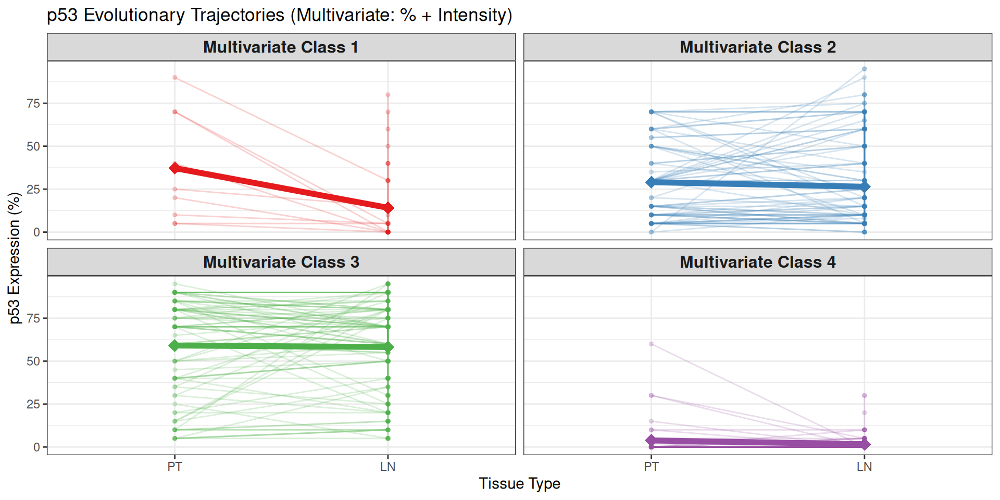

</figure>

</section>
<section id="kaplan-meier-survival-by-multivariate-trajectory" class="level4">
<h4 class="anchored" data-anchor-id="kaplan-meier-survival-by-multivariate-trajectory">Kaplan-Meier Survival by Multivariate Trajectory</h4>

<figure class="figure">

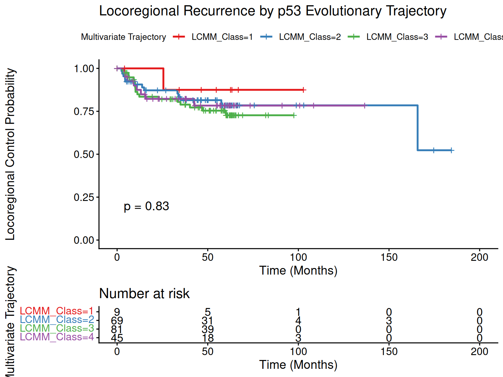

</figure>

<!-- #### Testing LCMM Clusters for Clinical Confounders -->

<table class="gt_table caption-top table table-sm table-striped small" data-quarto-postprocess="true" data-quarto-disable-processing="false" data-quarto-bootstrap="false">
<colgroup>
<col style="width: 16%">
<col style="width: 16%">
<col style="width: 16%">
<col style="width: 16%">
<col style="width: 16%">
<col style="width: 16%">
</colgroup>
<thead>
<tr class="gt_col_headings header">
<th id="label" class="gt_col_heading gt_columns_bottom_border gt_left" data-quarto-table-cell-role="th" scope="col"><strong>Characteristic</strong></th>
<th id="stat_1" class="gt_col_heading gt_columns_bottom_border gt_center" data-quarto-table-cell-role="th" scope="col"><strong>Class 1</strong> 
N = 91</th>
<th id="stat_2" class="gt_col_heading gt_columns_bottom_border gt_center" data-quarto-table-cell-role="th" scope="col"><strong>Class 2</strong> 
N = 701</th>
<th id="stat_3" class="gt_col_heading gt_columns_bottom_border gt_center" data-quarto-table-cell-role="th" scope="col"><strong>Class 3</strong> 
N = 841</th>
<th id="stat_4" class="gt_col_heading gt_columns_bottom_border gt_center" data-quarto-table-cell-role="th" scope="col"><strong>Class 4</strong> 
N = 451</th>
<th id="p.value" class="gt_col_heading gt_columns_bottom_border gt_center" data-quarto-table-cell-role="th" scope="col"><strong>p-value</strong>2</th>
</tr>
</thead>
<tbody class="gt_table_body">
<tr class="odd">
<td class="gt_row gt_left" headers="label">Age</td>
<td class="gt_row gt_center" headers="stat_1">56 (52, 61)</td>
<td class="gt_row gt_center" headers="stat_2">58 (53, 66)</td>
<td class="gt_row gt_center" headers="stat_3">54 (49, 61)</td>
<td class="gt_row gt_center" headers="stat_4">57 (50, 64)</td>
<td class="gt_row gt_center" headers="p.value">0.12</td>
</tr>
<tr class="even">
<td class="gt_row gt_left" headers="label">T Stage</td>
<td class="gt_row gt_center" headers="stat_1"> 
</td>
<td class="gt_row gt_center" headers="stat_2"> 
</td>
<td class="gt_row gt_center" headers="stat_3"> 
</td>
<td class="gt_row gt_center" headers="stat_4"> 
</td>
<td class="gt_row gt_center" headers="p.value">0.8</td>
</tr>
<tr class="odd">
<td class="gt_row gt_left" headers="label">&nbsp;&nbsp;&nbsp;&nbsp;High T (T3-T4)</td>
<td class="gt_row gt_center" headers="stat_1">3 (43%)</td>
<td class="gt_row gt_center" headers="stat_2">22 (51%)</td>
<td class="gt_row gt_center" headers="stat_3">28 (52%)</td>
<td class="gt_row gt_center" headers="stat_4">12 (41%)</td>
<td class="gt_row gt_center" headers="p.value"> 
</td>
</tr>
<tr class="even">
<td class="gt_row gt_left" headers="label">&nbsp;&nbsp;&nbsp;&nbsp;Low T (T1-T2)</td>
<td class="gt_row gt_center" headers="stat_1">4 (57%)</td>
<td class="gt_row gt_center" headers="stat_2">21 (49%)</td>
<td class="gt_row gt_center" headers="stat_3">26 (48%)</td>
<td class="gt_row gt_center" headers="stat_4">17 (59%)</td>
<td class="gt_row gt_center" headers="p.value"> 
</td>
</tr>
<tr class="odd">
<td class="gt_row gt_left" headers="label">HPV Status</td>
<td class="gt_row gt_center" headers="stat_1"> 
</td>
<td class="gt_row gt_center" headers="stat_2"> 
</td>
<td class="gt_row gt_center" headers="stat_3"> 
</td>
<td class="gt_row gt_center" headers="stat_4"> 
</td>
<td class="gt_row gt_center" headers="p.value">0.002</td>
</tr>
<tr class="even">
<td class="gt_row gt_left" headers="label">&nbsp;&nbsp;&nbsp;&nbsp;HPV_Neg</td>
<td class="gt_row gt_center" headers="stat_1">2 (50%)</td>
<td class="gt_row gt_center" headers="stat_2">16 (34%)</td>
<td class="gt_row gt_center" headers="stat_3">30 (61%)</td>
<td class="gt_row gt_center" headers="stat_4">21 (75%)</td>
<td class="gt_row gt_center" headers="p.value"> 
</td>
</tr>
<tr class="odd">
<td class="gt_row gt_left" headers="label">&nbsp;&nbsp;&nbsp;&nbsp;HPV_Pos</td>
<td class="gt_row gt_center" headers="stat_1">2 (50%)</td>
<td class="gt_row gt_center" headers="stat_2">31 (66%)</td>
<td class="gt_row gt_center" headers="stat_3">19 (39%)</td>
<td class="gt_row gt_center" headers="stat_4">7 (25%)</td>
<td class="gt_row gt_center" headers="p.value"> 
</td>
</tr>
</tbody><tfoot>
<tr class="gt_footnotes odd">
<td colspan="6" class="gt_footnote">1 Median (Q1, Q3); n (%)</td>
</tr>
<tr class="gt_footnotes even">
<td colspan="6" class="gt_footnote">2 Kruskal-Wallis rank sum test; Fisher’s exact test</td>
</tr>
</tfoot>

</table>

</section>
</section>
<section id="p16-trajectory" class="level3">
<h3 class="anchored" data-anchor-id="p16-trajectory">p16 Trajectory</h3>
<section id="information-criteria-entropy-bic-and-aic-1" class="level4">
<h4 class="anchored" data-anchor-id="information-criteria-entropy-bic-and-aic-1">Information Criteria (entropy, BIC and AIC)</h4>

<table class="caption-top table table-sm table-striped small">
<caption>Model Fit Comparison: 2 to 6 Clusters</caption>
<thead>
<tr class="header">
<th style="text-align: left;"></th>
<th style="text-align: right;">AIC</th>
<th style="text-align: right;">BIC</th>
<th style="text-align: right;">entropy</th>
</tr>
</thead>
<tbody>
<tr class="odd">
<td style="text-align: left;">m2_multi_cov</td>
<td style="text-align: right;">8375.60</td>
<td style="text-align: right;">8408.97</td>
<td style="text-align: right;">0.99</td>
</tr>
<tr class="even">
<td style="text-align: left;">m3_multi_cov</td>
<td style="text-align: right;">8357.52</td>
<td style="text-align: right;">8400.91</td>
<td style="text-align: right;">0.98</td>
</tr>
<tr class="odd">
<td style="text-align: left;">m4_multi_cov</td>
<td style="text-align: right;">7774.45</td>
<td style="text-align: right;">7827.85</td>
<td style="text-align: right;">1.00</td>
</tr>
<tr class="even">
<td style="text-align: left;">m5_multi_cov</td>
<td style="text-align: right;">7731.86</td>
<td style="text-align: right;">7795.27</td>
<td style="text-align: right;">1.00</td>
</tr>
<tr class="odd">
<td style="text-align: left;">m6_multi_cov</td>
<td style="text-align: right;">7737.86</td>
<td style="text-align: right;">7811.28</td>
<td style="text-align: right;">0.78</td>
</tr>
</tbody>
</table>

</section>
<section id="selected-4-clusters-1" class="level4">
<h4 class="anchored" data-anchor-id="selected-4-clusters-1">Selected: 4 clusters</h4>

<pre><code>                                     coef      Se   Wald p-value
intercept class1 (not estimated)  0.00000      NA     NA      NA
intercept class2                  5.02343 0.97268  5.165 0.00000
intercept class3                 28.80719 3.52062  8.182 0.00000
intercept class4                 19.34039 2.51150  7.701 0.00000
Tissue_Time class1               -0.35332 0.21170 -1.669 0.09512
Tissue_Time class2               11.83322 1.61287  7.337 0.00000
Tissue_Time class3                0.58288 0.36970  1.577 0.11488
Tissue_Time class4               -7.27974 1.17043 -6.220 0.00000</code></pre>

</section>
<section id="visualizing-the-multivariate-evolutionary-trajectories-1" class="level4">
<h4 class="anchored" data-anchor-id="visualizing-the-multivariate-evolutionary-trajectories-1">Visualizing the Multivariate Evolutionary Trajectories</h4>

<figure class="figure">

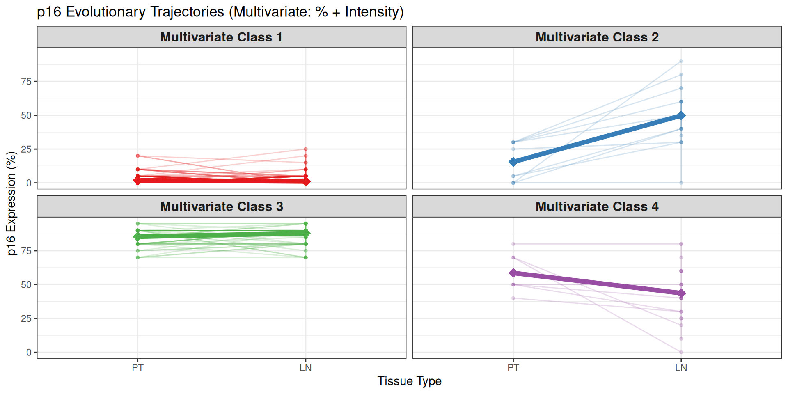

</figure>

</section>
<section id="kaplan-meier-survival-by-multivariate-trajectory-1" class="level4">
<h4 class="anchored" data-anchor-id="kaplan-meier-survival-by-multivariate-trajectory-1">Kaplan-Meier Survival by Multivariate Trajectory</h4>

<figure class="figure">

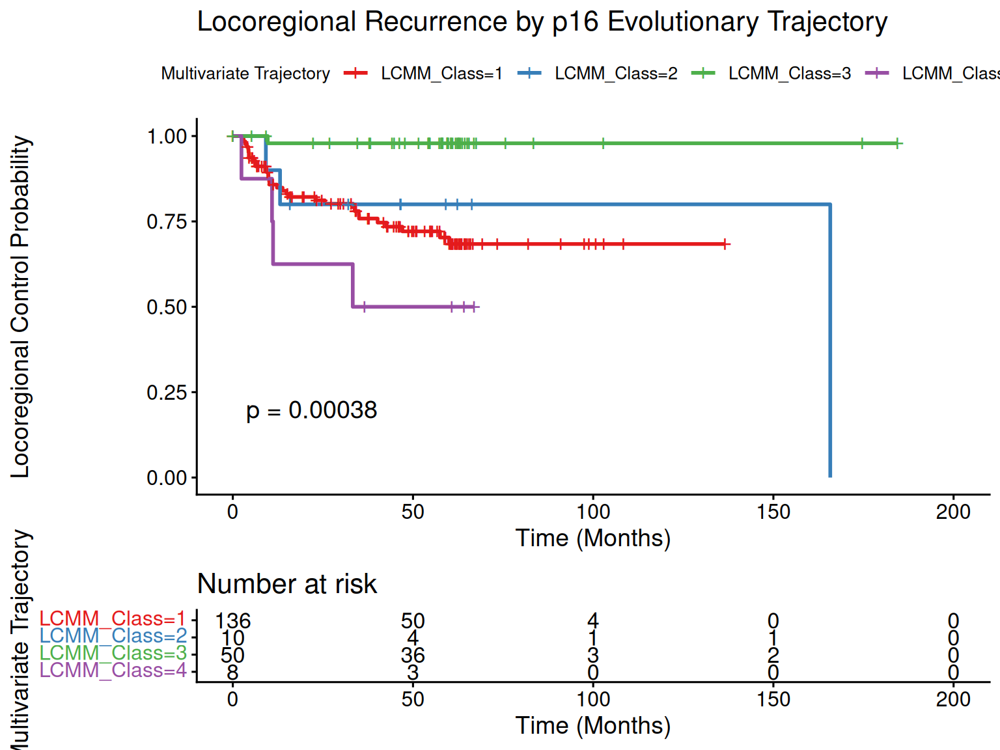

</figure>

<table class="gt_table caption-top table table-sm table-striped small" data-quarto-postprocess="true" data-quarto-disable-processing="false" data-quarto-bootstrap="false">
<colgroup>
<col style="width: 16%">
<col style="width: 16%">
<col style="width: 16%">
<col style="width: 16%">
<col style="width: 16%">
<col style="width: 16%">
</colgroup>
<thead>
<tr class="gt_col_headings header">
<th id="label" class="gt_col_heading gt_columns_bottom_border gt_left" data-quarto-table-cell-role="th" scope="col"><strong>Characteristic</strong></th>
<th id="stat_1" class="gt_col_heading gt_columns_bottom_border gt_center" data-quarto-table-cell-role="th" scope="col"><strong>Class 1</strong> 
N = 1401</th>
<th id="stat_2" class="gt_col_heading gt_columns_bottom_border gt_center" data-quarto-table-cell-role="th" scope="col"><strong>Class 2</strong> 
N = 101</th>
<th id="stat_3" class="gt_col_heading gt_columns_bottom_border gt_center" data-quarto-table-cell-role="th" scope="col"><strong>Class 3</strong> 
N = 501</th>
<th id="stat_4" class="gt_col_heading gt_columns_bottom_border gt_center" data-quarto-table-cell-role="th" scope="col"><strong>Class 4</strong> 
N = 81</th>
<th id="p.value" class="gt_col_heading gt_columns_bottom_border gt_center" data-quarto-table-cell-role="th" scope="col"><strong>p-value</strong>2</th>
</tr>
</thead>
<tbody class="gt_table_body">
<tr class="odd">
<td class="gt_row gt_left" headers="label">Age</td>
<td class="gt_row gt_center" headers="stat_1">55 (49, 61)</td>
<td class="gt_row gt_center" headers="stat_2">59 (50, 65)</td>
<td class="gt_row gt_center" headers="stat_3">60 (52, 66)</td>
<td class="gt_row gt_center" headers="stat_4">60 (53, 64)</td>
<td class="gt_row gt_center" headers="p.value">0.11</td>
</tr>
<tr class="even">
<td class="gt_row gt_left" headers="label">T Stage</td>
<td class="gt_row gt_center" headers="stat_1"> 
</td>
<td class="gt_row gt_center" headers="stat_2"> 
</td>
<td class="gt_row gt_center" headers="stat_3"> 
</td>
<td class="gt_row gt_center" headers="stat_4"> 
</td>
<td class="gt_row gt_center" headers="p.value">&gt;0.9</td>
</tr>
<tr class="odd">
<td class="gt_row gt_left" headers="label">&nbsp;&nbsp;&nbsp;&nbsp;High T (T3-T4)</td>
<td class="gt_row gt_center" headers="stat_1">47 (48%)</td>
<td class="gt_row gt_center" headers="stat_2">5 (63%)</td>
<td class="gt_row gt_center" headers="stat_3">11 (46%)</td>
<td class="gt_row gt_center" headers="stat_4">2 (50%)</td>
<td class="gt_row gt_center" headers="p.value"> 
</td>
</tr>
<tr class="even">
<td class="gt_row gt_left" headers="label">&nbsp;&nbsp;&nbsp;&nbsp;Low T (T1-T2)</td>
<td class="gt_row gt_center" headers="stat_1">50 (52%)</td>
<td class="gt_row gt_center" headers="stat_2">3 (38%)</td>
<td class="gt_row gt_center" headers="stat_3">13 (54%)</td>
<td class="gt_row gt_center" headers="stat_4">2 (50%)</td>
<td class="gt_row gt_center" headers="p.value"> 
</td>
</tr>
<tr class="odd">
<td class="gt_row gt_left" headers="label">HPV Status</td>
<td class="gt_row gt_center" headers="stat_1"> 
</td>
<td class="gt_row gt_center" headers="stat_2"> 
</td>
<td class="gt_row gt_center" headers="stat_3"> 
</td>
<td class="gt_row gt_center" headers="stat_4"> 
</td>
<td class="gt_row gt_center" headers="p.value">&lt;0.001</td>
</tr>
<tr class="even">
<td class="gt_row gt_left" headers="label">&nbsp;&nbsp;&nbsp;&nbsp;HPV_Neg</td>
<td class="gt_row gt_center" headers="stat_1">61 (90%)</td>
<td class="gt_row gt_center" headers="stat_2">3 (43%)</td>
<td class="gt_row gt_center" headers="stat_3">0 (0%)</td>
<td class="gt_row gt_center" headers="stat_4">5 (83%)</td>
<td class="gt_row gt_center" headers="p.value"> 
</td>
</tr>
<tr class="odd">
<td class="gt_row gt_left" headers="label">&nbsp;&nbsp;&nbsp;&nbsp;HPV_Pos</td>
<td class="gt_row gt_center" headers="stat_1">7 (10%)</td>
<td class="gt_row gt_center" headers="stat_2">4 (57%)</td>
<td class="gt_row gt_center" headers="stat_3">47 (100%)</td>
<td class="gt_row gt_center" headers="stat_4">1 (17%)</td>
<td class="gt_row gt_center" headers="p.value"> 
</td>
</tr>
</tbody><tfoot>
<tr class="gt_footnotes odd">
<td colspan="6" class="gt_footnote">1 Median (Q1, Q3); n (%)</td>
</tr>
<tr class="gt_footnotes even">
<td colspan="6" class="gt_footnote">2 Kruskal-Wallis rank sum test; Fisher’s exact test</td>
</tr>
</tfoot>

</table>

</section>
</section>
<section id="cd44-trajectory" class="level3">
<h3 class="anchored" data-anchor-id="cd44-trajectory">CD44 Trajectory</h3>
<section id="information-criteria-entropy-bic-and-aic-2" class="level4">
<h4 class="anchored" data-anchor-id="information-criteria-entropy-bic-and-aic-2">Information Criteria (entropy, BIC and AIC)</h4>

<table class="caption-top table table-sm table-striped small">
<caption>Model Fit Comparison: 2 to 6 Clusters</caption>
<thead>
<tr class="header">
<th style="text-align: left;"></th>
<th style="text-align: right;">AIC</th>
<th style="text-align: right;">BIC</th>
<th style="text-align: right;">entropy</th>
</tr>
</thead>
<tbody>
<tr class="odd">
<td style="text-align: left;">m2_multi_cov</td>
<td style="text-align: right;">9080.39</td>
<td style="text-align: right;">9113.76</td>
<td style="text-align: right;">0.66</td>
</tr>
<tr class="even">
<td style="text-align: left;">m3_multi_cov</td>
<td style="text-align: right;">9048.81</td>
<td style="text-align: right;">9092.20</td>
<td style="text-align: right;">0.75</td>
</tr>
<tr class="odd">
<td style="text-align: left;">m4_multi_cov</td>
<td style="text-align: right;">9007.85</td>
<td style="text-align: right;">9061.25</td>
<td style="text-align: right;">0.81</td>
</tr>
<tr class="even">
<td style="text-align: left;">m5_multi_cov</td>
<td style="text-align: right;">9013.85</td>
<td style="text-align: right;">9077.26</td>
<td style="text-align: right;">0.67</td>
</tr>
<tr class="odd">
<td style="text-align: left;">m6_multi_cov</td>
<td style="text-align: right;">9019.85</td>
<td style="text-align: right;">9093.27</td>
<td style="text-align: right;">0.70</td>
</tr>
</tbody>
</table>

</section>
<section id="selected-4-clusters-2" class="level4">
<h4 class="anchored" data-anchor-id="selected-4-clusters-2">Selected: 4 clusters</h4>

<pre><code>                                     coef      Se   Wald p-value
intercept class1 (not estimated)  0.00000      NA     NA      NA
intercept class2                 -4.90407 0.77773 -6.306 0.00000
intercept class3                 -4.94284 0.63137 -7.829 0.00000
intercept class4                  0.60441 0.47617  1.269 0.20433
Tissue_Time class1               -3.78615 0.50727 -7.464 0.00000
Tissue_Time class2                5.21829 0.78102  6.681 0.00000
Tissue_Time class3                0.46228 0.25517  1.812 0.07004
Tissue_Time class4               -0.03679 0.24728 -0.149 0.88173</code></pre>

</section>
<section id="visualizing-the-multivariate-evolutionary-trajectories-2" class="level4">
<h4 class="anchored" data-anchor-id="visualizing-the-multivariate-evolutionary-trajectories-2">Visualizing the Multivariate Evolutionary Trajectories</h4>

<figure class="figure">

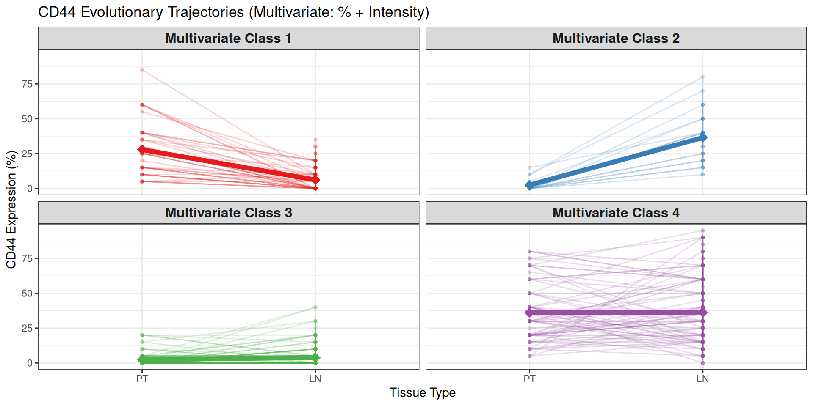

</figure>

</section>
<section id="kaplan-meier-survival-by-multivariate-trajectory-2" class="level4">
<h4 class="anchored" data-anchor-id="kaplan-meier-survival-by-multivariate-trajectory-2">Kaplan-Meier Survival by Multivariate Trajectory</h4>

<figure class="figure">

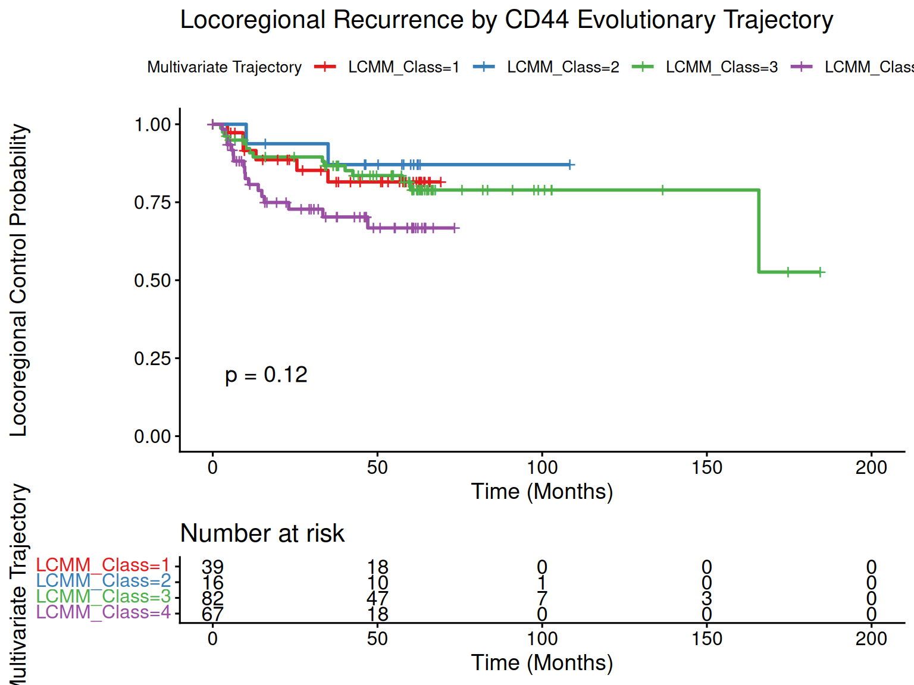

</figure>

<table class="gt_table caption-top table table-sm table-striped small" data-quarto-postprocess="true" data-quarto-disable-processing="false" data-quarto-bootstrap="false">
<colgroup>
<col style="width: 16%">
<col style="width: 16%">
<col style="width: 16%">
<col style="width: 16%">
<col style="width: 16%">
<col style="width: 16%">
</colgroup>
<thead>
<tr class="gt_col_headings header">
<th id="label" class="gt_col_heading gt_columns_bottom_border gt_left" data-quarto-table-cell-role="th" scope="col"><strong>Characteristic</strong></th>
<th id="stat_1" class="gt_col_heading gt_columns_bottom_border gt_center" data-quarto-table-cell-role="th" scope="col"><strong>Class 1</strong> 
N = 391</th>
<th id="stat_2" class="gt_col_heading gt_columns_bottom_border gt_center" data-quarto-table-cell-role="th" scope="col"><strong>Class 2</strong> 
N = 161</th>
<th id="stat_3" class="gt_col_heading gt_columns_bottom_border gt_center" data-quarto-table-cell-role="th" scope="col"><strong>Class 3</strong> 
N = 821</th>
<th id="stat_4" class="gt_col_heading gt_columns_bottom_border gt_center" data-quarto-table-cell-role="th" scope="col"><strong>Class 4</strong> 
N = 711</th>
<th id="p.value" class="gt_col_heading gt_columns_bottom_border gt_center" data-quarto-table-cell-role="th" scope="col"><strong>p-value</strong>2</th>
</tr>
</thead>
<tbody class="gt_table_body">
<tr class="odd">
<td class="gt_row gt_left" headers="label">Age</td>
<td class="gt_row gt_center" headers="stat_1">57 (52, 63)</td>
<td class="gt_row gt_center" headers="stat_2">53 (47, 59)</td>
<td class="gt_row gt_center" headers="stat_3">57 (50, 65)</td>
<td class="gt_row gt_center" headers="stat_4">55 (51, 64)</td>
<td class="gt_row gt_center" headers="p.value">0.3</td>
</tr>
<tr class="even">
<td class="gt_row gt_left" headers="label">T Stage</td>
<td class="gt_row gt_center" headers="stat_1"> 
</td>
<td class="gt_row gt_center" headers="stat_2"> 
</td>
<td class="gt_row gt_center" headers="stat_3"> 
</td>
<td class="gt_row gt_center" headers="stat_4"> 
</td>
<td class="gt_row gt_center" headers="p.value">0.13</td>
</tr>
<tr class="odd">
<td class="gt_row gt_left" headers="label">&nbsp;&nbsp;&nbsp;&nbsp;High T (T3-T4)</td>
<td class="gt_row gt_center" headers="stat_1">17 (57%)</td>
<td class="gt_row gt_center" headers="stat_2">3 (33%)</td>
<td class="gt_row gt_center" headers="stat_3">22 (39%)</td>
<td class="gt_row gt_center" headers="stat_4">23 (61%)</td>
<td class="gt_row gt_center" headers="p.value"> 
</td>
</tr>
<tr class="even">
<td class="gt_row gt_left" headers="label">&nbsp;&nbsp;&nbsp;&nbsp;Low T (T1-T2)</td>
<td class="gt_row gt_center" headers="stat_1">13 (43%)</td>
<td class="gt_row gt_center" headers="stat_2">6 (67%)</td>
<td class="gt_row gt_center" headers="stat_3">34 (61%)</td>
<td class="gt_row gt_center" headers="stat_4">15 (39%)</td>
<td class="gt_row gt_center" headers="p.value"> 
</td>
</tr>
<tr class="odd">
<td class="gt_row gt_left" headers="label">HPV Status</td>
<td class="gt_row gt_center" headers="stat_1"> 
</td>
<td class="gt_row gt_center" headers="stat_2"> 
</td>
<td class="gt_row gt_center" headers="stat_3"> 
</td>
<td class="gt_row gt_center" headers="stat_4"> 
</td>
<td class="gt_row gt_center" headers="p.value">0.018</td>
</tr>
<tr class="even">
<td class="gt_row gt_left" headers="label">&nbsp;&nbsp;&nbsp;&nbsp;HPV_Neg</td>
<td class="gt_row gt_center" headers="stat_1">16 (64%)</td>
<td class="gt_row gt_center" headers="stat_2">3 (50%)</td>
<td class="gt_row gt_center" headers="stat_3">24 (40%)</td>
<td class="gt_row gt_center" headers="stat_4">26 (70%)</td>
<td class="gt_row gt_center" headers="p.value"> 
</td>
</tr>
<tr class="odd">
<td class="gt_row gt_left" headers="label">&nbsp;&nbsp;&nbsp;&nbsp;HPV_Pos</td>
<td class="gt_row gt_center" headers="stat_1">9 (36%)</td>
<td class="gt_row gt_center" headers="stat_2">3 (50%)</td>
<td class="gt_row gt_center" headers="stat_3">36 (60%)</td>
<td class="gt_row gt_center" headers="stat_4">11 (30%)</td>
<td class="gt_row gt_center" headers="p.value"> 
</td>
</tr>
</tbody><tfoot>
<tr class="gt_footnotes odd">
<td colspan="6" class="gt_footnote">1 Median (Q1, Q3); n (%)</td>
</tr>
<tr class="gt_footnotes even">
<td colspan="6" class="gt_footnote">2 Kruskal-Wallis rank sum test; Fisher’s exact test</td>
</tr>
</tfoot>

</table>

</section>
</section>
<section id="cd98-trajectory" class="level3">
<h3 class="anchored" data-anchor-id="cd98-trajectory">CD98 Trajectory</h3>
<section id="information-criteria-entropy-bic-and-aic-3" class="level4">
<h4 class="anchored" data-anchor-id="information-criteria-entropy-bic-and-aic-3">Information Criteria (entropy, BIC and AIC)</h4>

<table class="caption-top table table-sm table-striped small">
<caption>Model Fit Comparison: 2 to 6 Clusters</caption>
<thead>
<tr class="header">
<th style="text-align: left;"></th>
<th style="text-align: right;">AIC</th>
<th style="text-align: right;">BIC</th>
<th style="text-align: right;">entropy</th>
</tr>
</thead>
<tbody>
<tr class="odd">
<td style="text-align: left;">m2_multi_cov</td>
<td style="text-align: right;">9164.54</td>
<td style="text-align: right;">9197.91</td>
<td style="text-align: right;">0.63</td>
</tr>
<tr class="even">
<td style="text-align: left;">m3_multi_cov</td>
<td style="text-align: right;">9167.66</td>
<td style="text-align: right;">9211.05</td>
<td style="text-align: right;">0.48</td>
</tr>
<tr class="odd">
<td style="text-align: left;">m4_multi_cov</td>
<td style="text-align: right;">9161.63</td>
<td style="text-align: right;">9215.03</td>
<td style="text-align: right;">0.70</td>
</tr>
<tr class="even">
<td style="text-align: left;">m5_multi_cov</td>
<td style="text-align: right;">9158.90</td>
<td style="text-align: right;">9222.31</td>
<td style="text-align: right;">0.68</td>
</tr>
<tr class="odd">
<td style="text-align: left;">m6_multi_cov</td>
<td style="text-align: right;">9162.93</td>
<td style="text-align: right;">9236.36</td>
<td style="text-align: right;">0.61</td>
</tr>
</tbody>
</table>

</section>
<section id="selected-4-clusters-3" class="level4">
<h4 class="anchored" data-anchor-id="selected-4-clusters-3">Selected: 4 clusters</h4>

<pre><code>                                     coef      Se   Wald p-value
intercept class1 (not estimated)  0.00000      NA     NA      NA
intercept class2                  5.79826 1.54435  3.755 0.00017
intercept class3                 -1.91037 1.68330 -1.135 0.25642
intercept class4                  3.77791 1.00695  3.752 0.00018
Tissue_Time class1               -1.46018 0.61803 -2.363 0.01815
Tissue_Time class2                0.57385 0.28492  2.014 0.04400
Tissue_Time class3                4.28452 1.83388  2.336 0.01948
Tissue_Time class4               -0.87635 0.46271 -1.894 0.05823</code></pre>

</section>
<section id="visualizing-the-multivariate-evolutionary-trajectories-3" class="level4">
<h4 class="anchored" data-anchor-id="visualizing-the-multivariate-evolutionary-trajectories-3">Visualizing the Multivariate Evolutionary Trajectories</h4>

<figure class="figure">

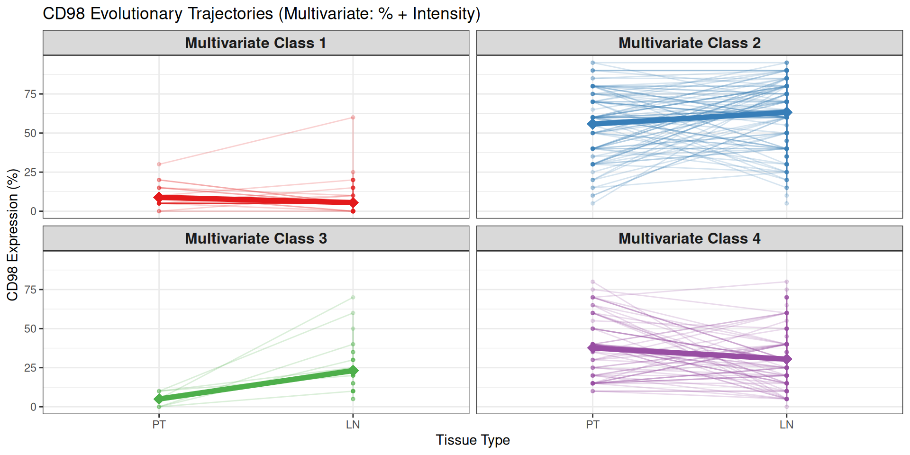

</figure>

</section>
<section id="kaplan-meier-survival-by-multivariate-trajectory-3" class="level4">
<h4 class="anchored" data-anchor-id="kaplan-meier-survival-by-multivariate-trajectory-3">Kaplan-Meier Survival by Multivariate Trajectory</h4>

<figure class="figure">

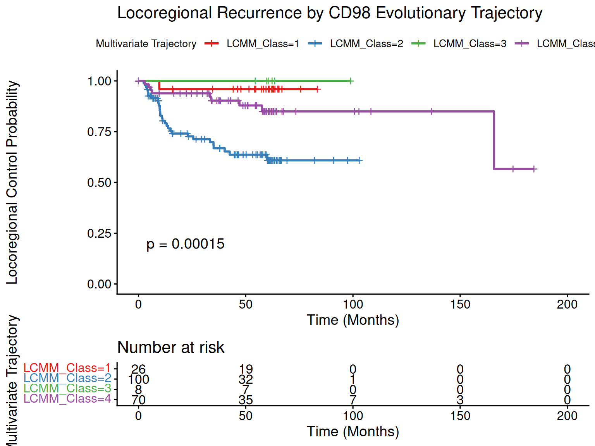

</figure>

<table class="gt_table caption-top table table-sm table-striped small" data-quarto-postprocess="true" data-quarto-disable-processing="false" data-quarto-bootstrap="false">
<colgroup>
<col style="width: 16%">
<col style="width: 16%">
<col style="width: 16%">
<col style="width: 16%">
<col style="width: 16%">
<col style="width: 16%">
</colgroup>
<thead>
<tr class="gt_col_headings header">
<th id="label" class="gt_col_heading gt_columns_bottom_border gt_left" data-quarto-table-cell-role="th" scope="col"><strong>Characteristic</strong></th>
<th id="stat_1" class="gt_col_heading gt_columns_bottom_border gt_center" data-quarto-table-cell-role="th" scope="col"><strong>Class 1</strong> 
N = 261</th>
<th id="stat_2" class="gt_col_heading gt_columns_bottom_border gt_center" data-quarto-table-cell-role="th" scope="col"><strong>Class 2</strong> 
N = 1041</th>
<th id="stat_3" class="gt_col_heading gt_columns_bottom_border gt_center" data-quarto-table-cell-role="th" scope="col"><strong>Class 3</strong> 
N = 81</th>
<th id="stat_4" class="gt_col_heading gt_columns_bottom_border gt_center" data-quarto-table-cell-role="th" scope="col"><strong>Class 4</strong> 
N = 701</th>
<th id="p.value" class="gt_col_heading gt_columns_bottom_border gt_center" data-quarto-table-cell-role="th" scope="col"><strong>p-value</strong>2</th>
</tr>
</thead>
<tbody class="gt_table_body">
<tr class="odd">
<td class="gt_row gt_left" headers="label">Age</td>
<td class="gt_row gt_center" headers="stat_1">61 (52, 64)</td>
<td class="gt_row gt_center" headers="stat_2">55 (48, 61)</td>
<td class="gt_row gt_center" headers="stat_3">62 (58, 66)</td>
<td class="gt_row gt_center" headers="stat_4">56 (51, 66)</td>
<td class="gt_row gt_center" headers="p.value">0.031</td>
</tr>
<tr class="even">
<td class="gt_row gt_left" headers="label">T Stage</td>
<td class="gt_row gt_center" headers="stat_1"> 
</td>
<td class="gt_row gt_center" headers="stat_2"> 
</td>
<td class="gt_row gt_center" headers="stat_3"> 
</td>
<td class="gt_row gt_center" headers="stat_4"> 
</td>
<td class="gt_row gt_center" headers="p.value">0.061</td>
</tr>
<tr class="odd">
<td class="gt_row gt_left" headers="label">&nbsp;&nbsp;&nbsp;&nbsp;High T (T3-T4)</td>
<td class="gt_row gt_center" headers="stat_1">2 (15%)</td>
<td class="gt_row gt_center" headers="stat_2">36 (52%)</td>
<td class="gt_row gt_center" headers="stat_3">2 (67%)</td>
<td class="gt_row gt_center" headers="stat_4">25 (52%)</td>
<td class="gt_row gt_center" headers="p.value"> 
</td>
</tr>
<tr class="even">
<td class="gt_row gt_left" headers="label">&nbsp;&nbsp;&nbsp;&nbsp;Low T (T1-T2)</td>
<td class="gt_row gt_center" headers="stat_1">11 (85%)</td>
<td class="gt_row gt_center" headers="stat_2">33 (48%)</td>
<td class="gt_row gt_center" headers="stat_3">1 (33%)</td>
<td class="gt_row gt_center" headers="stat_4">23 (48%)</td>
<td class="gt_row gt_center" headers="p.value"> 
</td>
</tr>
<tr class="odd">
<td class="gt_row gt_left" headers="label">HPV Status</td>
<td class="gt_row gt_center" headers="stat_1"> 
</td>
<td class="gt_row gt_center" headers="stat_2"> 
</td>
<td class="gt_row gt_center" headers="stat_3"> 
</td>
<td class="gt_row gt_center" headers="stat_4"> 
</td>
<td class="gt_row gt_center" headers="p.value">&lt;0.001</td>
</tr>
<tr class="even">
<td class="gt_row gt_left" headers="label">&nbsp;&nbsp;&nbsp;&nbsp;HPV_Neg</td>
<td class="gt_row gt_center" headers="stat_1">1 (5.0%)</td>
<td class="gt_row gt_center" headers="stat_2">38 (75%)</td>
<td class="gt_row gt_center" headers="stat_3">1 (17%)</td>
<td class="gt_row gt_center" headers="stat_4">29 (57%)</td>
<td class="gt_row gt_center" headers="p.value"> 
</td>
</tr>
<tr class="odd">
<td class="gt_row gt_left" headers="label">&nbsp;&nbsp;&nbsp;&nbsp;HPV_Pos</td>
<td class="gt_row gt_center" headers="stat_1">19 (95%)</td>
<td class="gt_row gt_center" headers="stat_2">13 (25%)</td>
<td class="gt_row gt_center" headers="stat_3">5 (83%)</td>
<td class="gt_row gt_center" headers="stat_4">22 (43%)</td>
<td class="gt_row gt_center" headers="p.value"> 
</td>
</tr>
</tbody><tfoot>
<tr class="gt_footnotes odd">
<td colspan="6" class="gt_footnote">1 Median (Q1, Q3); n (%)</td>
</tr>
<tr class="gt_footnotes even">
<td colspan="6" class="gt_footnote">2 Kruskal-Wallis rank sum test; Fisher’s exact test</td>
</tr>
</tfoot>

</table>

</section>
</section>
</section>
<section id="discordance-rate" class="level2">
<h2 class="anchored" data-anchor-id="discordance-rate">Discordance rate</h2>

<pre><code>     Marker   N Percent
p53     p53   9    4.33
p16     p16  18    8.65
CD44   CD44  55   26.44
CD98   CD98 138   66.35</code></pre>

<pre><code>
Global results:</code></pre>

<pre><code>Unique patients = 165 </code></pre>

<pre><code>Percent = 79.33 %</code></pre>

</section>
<section id="takeaway-biomarker-expression-exhibits-high-inter-patient-instability-rather-than-a-uniform-directional-shift." class="level2">
<h2 class="anchored" data-anchor-id="takeaway-biomarker-expression-exhibits-high-inter-patient-instability-rather-than-a-uniform-directional-shift.">3. Takeaway: Biomarker expression exhibits high inter-patient instability rather than a uniform directional shift.</h2>

The multivariate latent class mixed model simultaneously incorporates
 both biomarker expression percentage and staining intensity, allowing 
the identification of patient subgroups that share similar evolutionary 
trajectories during metastatic progression for each of the markers 
considered. This approach reveals substantial heterogeneity in biomarker
 evolution across patients. The analysis identified distinct trajectory 
classes characterized by different patterns of expression. Patients from
 statistically significant clusters are identified as Discordant 
(different expression of the marker between PT and LN).

</section>
</section>
<section id="metastatic-co-evolution" class="level1">
<h1>5. Metastatic Co-Evolution</h1>

We investigate whether the evaluated biomarkers adapt independently 
during metastasis, or if they co-evolve as coupled biological pathways. 
To capture this evolutionary transition, we modeled the exact 
mathematical shift (the delta) of each marker between the Primary Tumor 
and its paired Lymph Node metastasis using Linear Mixed-Effects Models.

This approach isolates the active process of metastatic seeding, 
answering the question: If a specific marker significantly increases or 
decreases during the transition to the lymph node, does another marker 
predictably shift alongside it? Identifying these coupled adaptations 
can highlight shared biological drivers or coordinated resistance 
mechanisms in the metastatic niche.

<section id="mixed-models-on-metastatic-shifts" class="level2">
<h2 class="anchored" data-anchor-id="mixed-models-on-metastatic-shifts">5.1 Mixed Models on Metastatic Shifts</h2>
<section id="mixed-model-predicting-cd98-shift-via-cd44-shift" class="level3">
<h3 class="anchored" data-anchor-id="mixed-model-predicting-cd98-shift-via-cd44-shift">Mixed Model: Predicting CD98 Shift via CD44 Shift</h3>
<table>
<thead>
<tr>
<th style="empty-cells: hide;border-bottom:hidden;" colspan="1">
</th>
<th style="border-bottom:hidden;padding-bottom:0; padding-left:3px;padding-right:3px;text-align: center; " colspan="3">

CD98 Shift (LN - PT)

</th>
</tr>
<tr>
<th style="text-align:left;">
Predictors
</th>
<th style="text-align:left;">
Estimates
</th>
<th style="text-align:left;">
CI
</th>
<th style="text-align:left;">
p
</th>
</tr>
</thead>
<tbody>
<tr>
<td style="text-align:left;">
(Intercept)
</td>
<td style="text-align:left;">
1.93
</td>
<td style="text-align:left;">
-1.12&nbsp;–&nbsp;4.99
</td>
<td style="text-align:left;">
0.215
</td>
</tr>
<tr>
<td style="text-align:left;">
CD44 Shift
</td>
<td style="text-align:left;">
0.15
</td>
<td style="text-align:left;">
0.07&nbsp;–&nbsp;0.23
</td>
<td style="text-align:left;">
&lt;0.001
</td>
</tr>
<tr>
<td style="text-align:left;">
Random Effects
</td>
<td style="text-align:left;">
</td>
<td style="text-align:left;">
</td>
<td style="text-align:left;">
</td>
</tr>
<tr>
<td style="text-align:left;">
σ2
</td>
<td style="text-align:left;">
245.34
</td>
<td style="text-align:left;">
</td>
<td style="text-align:left;">
</td>
</tr>
<tr>
<td style="text-align:left;">
τ00patient_ID
</td>
<td style="text-align:left;">
362.93
</td>
<td style="text-align:left;">
</td>
<td style="text-align:left;">
</td>
</tr>
<tr>
<td style="text-align:left;">
ICC
</td>
<td style="text-align:left;">
0.60
</td>
<td style="text-align:left;">
</td>
<td style="text-align:left;">
</td>
</tr>
<tr>
<td style="text-align:left;">
N patient_ID
</td>
<td style="text-align:left;">
205
</td>
<td style="text-align:left;">
</td>
<td style="text-align:left;">
</td>
</tr>
<tr>
<td style="text-align:left;">
Observations
</td>
<td style="text-align:left;">
633
</td>
<td style="text-align:left;">
</td>
<td style="text-align:left;">
</td>
</tr>
<tr>
<td style="text-align:left;">
Marginal <mjx-container class="MathJax CtxtMenu_Attached_0" jax="CHTML" style="font-size: 117.1%; position: relative;" tabindex="0" ctxtmenu_counter="0"><mjx-math class="MJX-TEX" aria-hidden="true"><mjx-msup><mjx-mi class="mjx-i"><mjx-c class="mjx-c1D445 TEX-I"></mjx-c></mjx-mi><mjx-script style="vertical-align: 0.363em;"><mjx-mn class="mjx-n" size="s"><mjx-c class="mjx-c32"></mjx-c></mjx-mn></mjx-script></mjx-msup></mjx-math><mjx-assistive-mml unselectable="on" display="inline"><math xmlns="http://www.w3.org/1998/Math/MathML"><msup><mi>R</mi><mn>2</mn></msup></math></mjx-assistive-mml></mjx-container> / Conditional <mjx-container class="MathJax CtxtMenu_Attached_0" jax="CHTML" style="font-size: 117.1%; position: relative;" tabindex="0" ctxtmenu_counter="1"><mjx-math class="MJX-TEX" aria-hidden="true"><mjx-msup><mjx-mi class="mjx-i"><mjx-c class="mjx-c1D445 TEX-I"></mjx-c></mjx-mi><mjx-script style="vertical-align: 0.363em;"><mjx-mn class="mjx-n" size="s"><mjx-c class="mjx-c32"></mjx-c></mjx-mn></mjx-script></mjx-msup></mjx-math><mjx-assistive-mml unselectable="on" display="inline"><math xmlns="http://www.w3.org/1998/Math/MathML"><msup><mi>R</mi><mn>2</mn></msup></math></mjx-assistive-mml></mjx-container>
</td>
<td style="text-align:left;">
0.019 / 0.604
</td>
<td style="text-align:left;">
</td>
<td style="text-align:left;">
</td>
</tr>
</tbody>
</table>

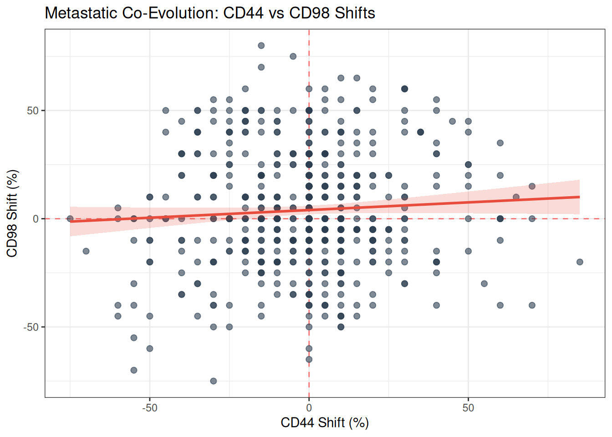

 

</section>
<section id="mixed-model-predicting-p53-shift-via-p16-shift" class="level3">
<h3 class="anchored" data-anchor-id="mixed-model-predicting-p53-shift-via-p16-shift">Mixed Model: Predicting p53 Shift via p16 Shift</h3>
<table>
<thead>
<tr>
<th style="empty-cells: hide;border-bottom:hidden;" colspan="1">
</th>
<th style="border-bottom:hidden;padding-bottom:0; padding-left:3px;padding-right:3px;text-align: center; " colspan="3">

p53 Shift (LN - PT)

</th>
</tr>
<tr>
<th style="text-align:left;">
Predictors
</th>
<th style="text-align:left;">
Estimates
</th>
<th style="text-align:left;">
CI
</th>
<th style="text-align:left;">
p
</th>
</tr>
</thead>
<tbody>
<tr>
<td style="text-align:left;">
(Intercept)
</td>
<td style="text-align:left;">
-0.08
</td>
<td style="text-align:left;">
-3.10&nbsp;–&nbsp;2.94
</td>
<td style="text-align:left;">
0.957
</td>
</tr>
<tr>
<td style="text-align:left;">
p16 Shift
</td>
<td style="text-align:left;">
0.03
</td>
<td style="text-align:left;">
-0.11&nbsp;–&nbsp;0.18
</td>
<td style="text-align:left;">
0.681
</td>
</tr>
<tr>
<td style="text-align:left;">
Random Effects
</td>
<td style="text-align:left;">
</td>
<td style="text-align:left;">
</td>
<td style="text-align:left;">
</td>
</tr>
<tr>
<td style="text-align:left;">
σ2
</td>
<td style="text-align:left;">
143.16
</td>
<td style="text-align:left;">
</td>
<td style="text-align:left;">
</td>
</tr>
<tr>
<td style="text-align:left;">
τ00patient_ID
</td>
<td style="text-align:left;">
398.66
</td>
<td style="text-align:left;">
</td>
<td style="text-align:left;">
</td>
</tr>
<tr>
<td style="text-align:left;">
ICC
</td>
<td style="text-align:left;">
0.74
</td>
<td style="text-align:left;">
</td>
<td style="text-align:left;">
</td>
</tr>
<tr>
<td style="text-align:left;">
N patient_ID
</td>
<td style="text-align:left;">
203
</td>
<td style="text-align:left;">
</td>
<td style="text-align:left;">
</td>
</tr>
<tr>
<td style="text-align:left;">
Observations
</td>
<td style="text-align:left;">
630
</td>
<td style="text-align:left;">
</td>
<td style="text-align:left;">
</td>
</tr>
<tr>
<td style="text-align:left;">
Marginal <mjx-container class="MathJax CtxtMenu_Attached_0" jax="CHTML" style="font-size: 117.1%; position: relative;" tabindex="0" ctxtmenu_counter="2"><mjx-math class="MJX-TEX" aria-hidden="true"><mjx-msup><mjx-mi class="mjx-i"><mjx-c class="mjx-c1D445 TEX-I"></mjx-c></mjx-mi><mjx-script style="vertical-align: 0.363em;"><mjx-mn class="mjx-n" size="s"><mjx-c class="mjx-c32"></mjx-c></mjx-mn></mjx-script></mjx-msup></mjx-math><mjx-assistive-mml unselectable="on" display="inline"><math xmlns="http://www.w3.org/1998/Math/MathML"><msup><mi>R</mi><mn>2</mn></msup></math></mjx-assistive-mml></mjx-container> / Conditional <mjx-container class="MathJax CtxtMenu_Attached_0" jax="CHTML" style="font-size: 117.1%; position: relative;" tabindex="0" ctxtmenu_counter="3"><mjx-math class="MJX-TEX" aria-hidden="true"><mjx-msup><mjx-mi class="mjx-i"><mjx-c class="mjx-c1D445 TEX-I"></mjx-c></mjx-mi><mjx-script style="vertical-align: 0.363em;"><mjx-mn class="mjx-n" size="s"><mjx-c class="mjx-c32"></mjx-c></mjx-mn></mjx-script></mjx-msup></mjx-math><mjx-assistive-mml unselectable="on" display="inline"><math xmlns="http://www.w3.org/1998/Math/MathML"><msup><mi>R</mi><mn>2</mn></msup></math></mjx-assistive-mml></mjx-container>
</td>
<td style="text-align:left;">
0.000 / 0.736
</td>
<td style="text-align:left;">
</td>
<td style="text-align:left;">
</td>
</tr>
</tbody>
</table>

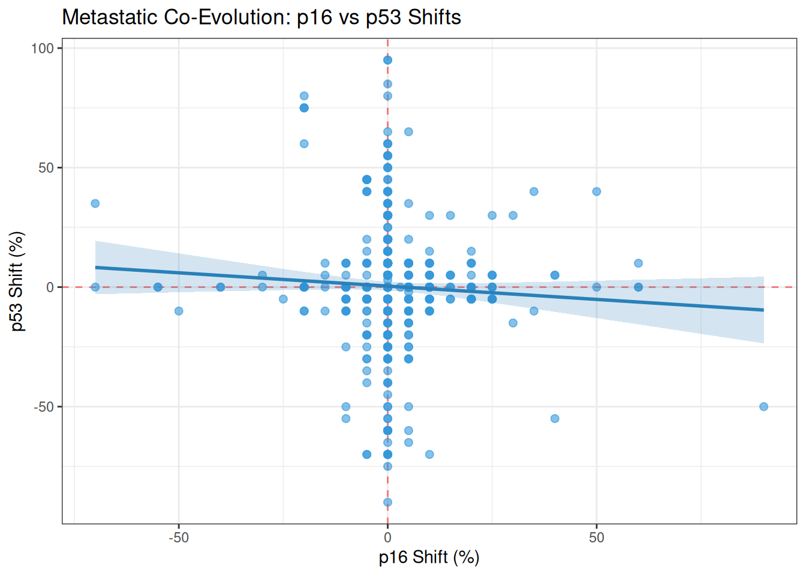

 

</section>
<section id="mixed-model-predicting-p16-shift-via-cd98-shift" class="level3">
<h3 class="anchored" data-anchor-id="mixed-model-predicting-p16-shift-via-cd98-shift">Mixed Model: Predicting p16 Shift via CD98 Shift</h3>
<table>
<thead>
<tr>
<th style="empty-cells: hide;border-bottom:hidden;" colspan="1">
</th>
<th style="border-bottom:hidden;padding-bottom:0; padding-left:3px;padding-right:3px;text-align: center; " colspan="3">

p16 Shift (LN - PT)

</th>
</tr>
<tr>
<th style="text-align:left;">
Predictors
</th>
<th style="text-align:left;">
Estimates
</th>
<th style="text-align:left;">
CI
</th>
<th style="text-align:left;">
p
</th>
</tr>
</thead>
<tbody>
<tr>
<td style="text-align:left;">
(Intercept)
</td>
<td style="text-align:left;">
0.64
</td>
<td style="text-align:left;">
-0.98&nbsp;–&nbsp;2.27
</td>
<td style="text-align:left;">
0.437
</td>
</tr>
<tr>
<td style="text-align:left;">
CD98 Shift
</td>
<td style="text-align:left;">
0.02
</td>
<td style="text-align:left;">
-0.01&nbsp;–&nbsp;0.06
</td>
<td style="text-align:left;">
0.164
</td>
</tr>
<tr>
<td style="text-align:left;">
Random Effects
</td>
<td style="text-align:left;">
</td>
<td style="text-align:left;">
</td>
<td style="text-align:left;">
</td>
</tr>
<tr>
<td style="text-align:left;">
σ2
</td>
<td style="text-align:left;">
41.48
</td>
<td style="text-align:left;">
</td>
<td style="text-align:left;">
</td>
</tr>
<tr>
<td style="text-align:left;">
τ00patient_ID
</td>
<td style="text-align:left;">
117.44
</td>
<td style="text-align:left;">
</td>
<td style="text-align:left;">
</td>
</tr>
<tr>
<td style="text-align:left;">
ICC
</td>
<td style="text-align:left;">
0.74
</td>
<td style="text-align:left;">
</td>
<td style="text-align:left;">
</td>
</tr>
<tr>
<td style="text-align:left;">
N patient_ID
</td>
<td style="text-align:left;">
205
</td>
<td style="text-align:left;">
</td>
<td style="text-align:left;">
</td>
</tr>
<tr>
<td style="text-align:left;">
Observations
</td>
<td style="text-align:left;">
634
</td>
<td style="text-align:left;">
</td>
<td style="text-align:left;">
</td>
</tr>
<tr>
<td style="text-align:left;">
Marginal <mjx-container class="MathJax CtxtMenu_Attached_0" jax="CHTML" style="font-size: 117.1%; position: relative;" tabindex="0" ctxtmenu_counter="4"><mjx-math class="MJX-TEX" aria-hidden="true"><mjx-msup><mjx-mi class="mjx-i"><mjx-c class="mjx-c1D445 TEX-I"></mjx-c></mjx-mi><mjx-script style="vertical-align: 0.363em;"><mjx-mn class="mjx-n" size="s"><mjx-c class="mjx-c32"></mjx-c></mjx-mn></mjx-script></mjx-msup></mjx-math><mjx-assistive-mml unselectable="on" display="inline"><math xmlns="http://www.w3.org/1998/Math/MathML"><msup><mi>R</mi><mn>2</mn></msup></math></mjx-assistive-mml></mjx-container> / Conditional <mjx-container class="MathJax CtxtMenu_Attached_0" jax="CHTML" style="font-size: 117.1%; position: relative;" tabindex="0" ctxtmenu_counter="5"><mjx-math class="MJX-TEX" aria-hidden="true"><mjx-msup><mjx-mi class="mjx-i"><mjx-c class="mjx-c1D445 TEX-I"></mjx-c></mjx-mi><mjx-script style="vertical-align: 0.363em;"><mjx-mn class="mjx-n" size="s"><mjx-c class="mjx-c32"></mjx-c></mjx-mn></mjx-script></mjx-msup></mjx-math><mjx-assistive-mml unselectable="on" display="inline"><math xmlns="http://www.w3.org/1998/Math/MathML"><msup><mi>R</mi><mn>2</mn></msup></math></mjx-assistive-mml></mjx-container>
</td>
<td style="text-align:left;">
0.002 / 0.740
</td>
<td style="text-align:left;">
</td>
<td style="text-align:left;">
</td>
</tr>
</tbody>
</table>

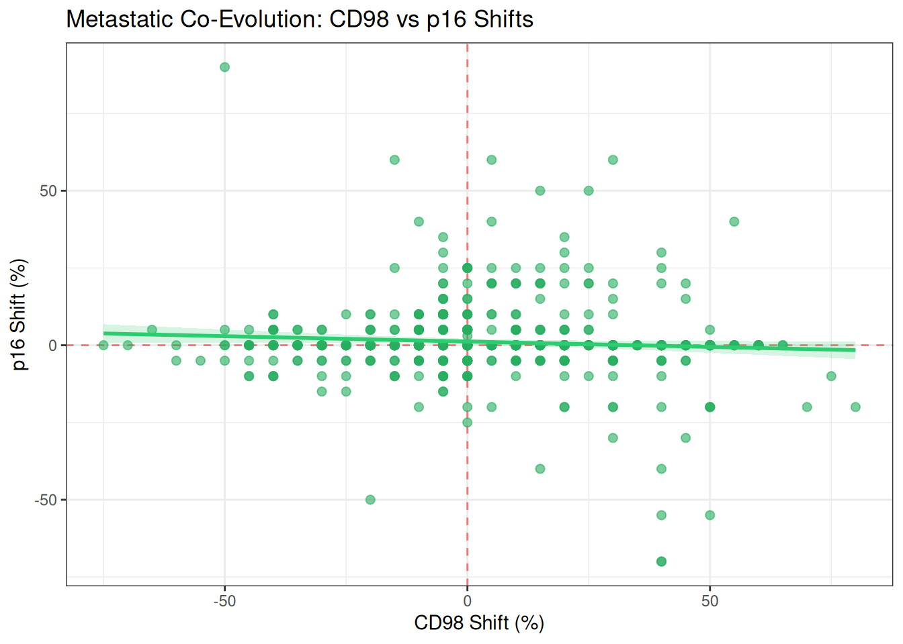

 

</section>
<section id="mixed-model-predicting-p53-shift-via-cd98-shift" class="level3">
<h3 class="anchored" data-anchor-id="mixed-model-predicting-p53-shift-via-cd98-shift">Mixed Model: Predicting p53 Shift via CD98 Shift</h3>
<table>
<thead>
<tr>
<th style="empty-cells: hide;border-bottom:hidden;" colspan="1">
</th>
<th style="border-bottom:hidden;padding-bottom:0; padding-left:3px;padding-right:3px;text-align: center; " colspan="3">

p53 Shift (LN - PT)

</th>
</tr>
<tr>
<th style="text-align:left;">
Predictors
</th>
<th style="text-align:left;">
Estimates
</th>
<th style="text-align:left;">
CI
</th>
<th style="text-align:left;">
p
</th>
</tr>
</thead>
<tbody>
<tr>
<td style="text-align:left;">
(Intercept)
</td>
<td style="text-align:left;">
-0.16
</td>
<td style="text-align:left;">
-3.12&nbsp;–&nbsp;2.79
</td>
<td style="text-align:left;">
0.915
</td>
</tr>
<tr>
<td style="text-align:left;">
CD98 Shift
</td>
<td style="text-align:left;">
0.06
</td>
<td style="text-align:left;">
-0.01&nbsp;–&nbsp;0.12
</td>
<td style="text-align:left;">
0.081
</td>
</tr>
<tr>
<td style="text-align:left;">
Random Effects
</td>
<td style="text-align:left;">
</td>
<td style="text-align:left;">
</td>
<td style="text-align:left;">
</td>
</tr>
<tr>
<td style="text-align:left;">
σ2
</td>
<td style="text-align:left;">
143.87
</td>
<td style="text-align:left;">
</td>
<td style="text-align:left;">
</td>
</tr>
<tr>
<td style="text-align:left;">
τ00patient_ID
</td>
<td style="text-align:left;">
382.30
</td>
<td style="text-align:left;">
</td>
<td style="text-align:left;">
</td>
</tr>
<tr>
<td style="text-align:left;">
ICC
</td>
<td style="text-align:left;">
0.73
</td>
<td style="text-align:left;">
</td>
<td style="text-align:left;">
</td>
</tr>
<tr>
<td style="text-align:left;">
N patient_ID
</td>
<td style="text-align:left;">
205
</td>
<td style="text-align:left;">
</td>
<td style="text-align:left;">
</td>
</tr>
<tr>
<td style="text-align:left;">
Observations
</td>
<td style="text-align:left;">
632
</td>
<td style="text-align:left;">
</td>
<td style="text-align:left;">
</td>
</tr>
<tr>
<td style="text-align:left;">
Marginal <mjx-container class="MathJax CtxtMenu_Attached_0" jax="CHTML" style="font-size: 117.1%; position: relative;" tabindex="0" ctxtmenu_counter="6"><mjx-math class="MJX-TEX" aria-hidden="true"><mjx-msup><mjx-mi class="mjx-i"><mjx-c class="mjx-c1D445 TEX-I"></mjx-c></mjx-mi><mjx-script style="vertical-align: 0.363em;"><mjx-mn class="mjx-n" size="s"><mjx-c class="mjx-c32"></mjx-c></mjx-mn></mjx-script></mjx-msup></mjx-math><mjx-assistive-mml unselectable="on" display="inline"><math xmlns="http://www.w3.org/1998/Math/MathML"><msup><mi>R</mi><mn>2</mn></msup></math></mjx-assistive-mml></mjx-container> / Conditional <mjx-container class="MathJax CtxtMenu_Attached_0" jax="CHTML" style="font-size: 117.1%; position: relative;" tabindex="0" ctxtmenu_counter="7"><mjx-math class="MJX-TEX" aria-hidden="true"><mjx-msup><mjx-mi class="mjx-i"><mjx-c class="mjx-c1D445 TEX-I"></mjx-c></mjx-mi><mjx-script style="vertical-align: 0.363em;"><mjx-mn class="mjx-n" size="s"><mjx-c class="mjx-c32"></mjx-c></mjx-mn></mjx-script></mjx-msup></mjx-math><mjx-assistive-mml unselectable="on" display="inline"><math xmlns="http://www.w3.org/1998/Math/MathML"><msup><mi>R</mi><mn>2</mn></msup></math></mjx-assistive-mml></mjx-container>
</td>
<td style="text-align:left;">
0.004 / 0.728
</td>
<td style="text-align:left;">
</td>
<td style="text-align:left;">
</td>
</tr>
</tbody>
</table>

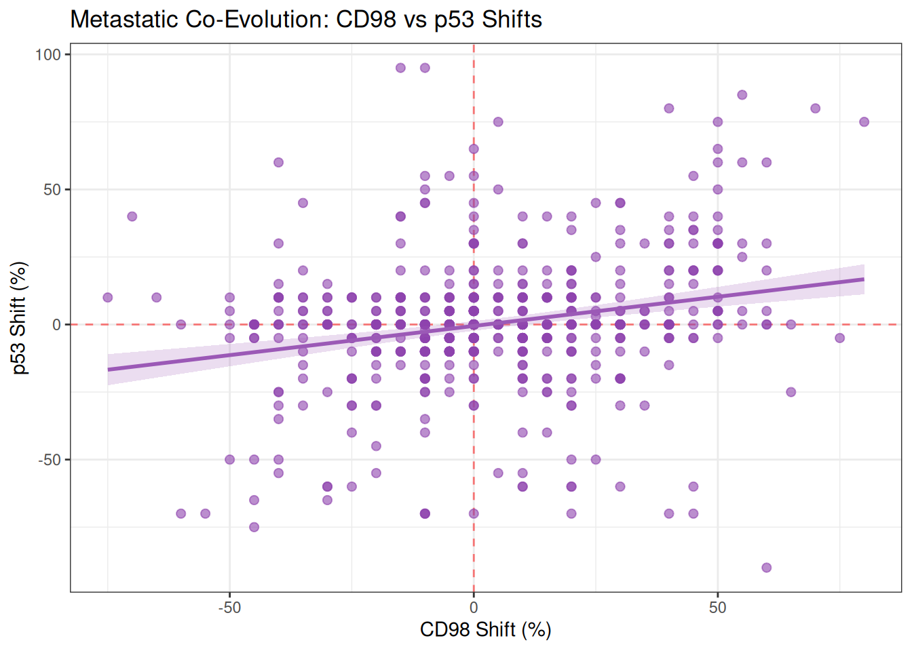

 

</section>
<section id="mixed-model-predicting-p16-shift-via-cd44-shift" class="level3">
<h3 class="anchored" data-anchor-id="mixed-model-predicting-p16-shift-via-cd44-shift">Mixed Model: Predicting p16 Shift via CD44 Shift</h3>
<table>
<thead>
<tr>
<th style="empty-cells: hide;border-bottom:hidden;" colspan="1">
</th>
<th style="border-bottom:hidden;padding-bottom:0; padding-left:3px;padding-right:3px;text-align: center; " colspan="3">

p16 Shift (LN - PT)

</th>
</tr>
<tr>
<th style="text-align:left;">
Predictors
</th>
<th style="text-align:left;">
Estimates
</th>
<th style="text-align:left;">
CI
</th>
<th style="text-align:left;">
p
</th>
</tr>
</thead>
<tbody>
<tr>
<td style="text-align:left;">
(Intercept)
</td>
<td style="text-align:left;">
0.61
</td>
<td style="text-align:left;">
-1.00&nbsp;–&nbsp;2.22
</td>
<td style="text-align:left;">
0.455
</td>
</tr>
<tr>
<td style="text-align:left;">
CD44 Shift
</td>
<td style="text-align:left;">
0.04
</td>
<td style="text-align:left;">
0.00&nbsp;–&nbsp;0.08
</td>
<td style="text-align:left;">
0.027
</td>
</tr>
<tr>
<td style="text-align:left;">
Random Effects
</td>
<td style="text-align:left;">
</td>
<td style="text-align:left;">
</td>
<td style="text-align:left;">
</td>
</tr>
<tr>
<td style="text-align:left;">
σ2
</td>
<td style="text-align:left;">
41.59
</td>
<td style="text-align:left;">
</td>
<td style="text-align:left;">
</td>
</tr>
<tr>
<td style="text-align:left;">
τ00patient_ID
</td>
<td style="text-align:left;">
112.40
</td>
<td style="text-align:left;">
</td>
<td style="text-align:left;">
</td>
</tr>
<tr>
<td style="text-align:left;">
ICC
</td>
<td style="text-align:left;">
0.73
</td>
<td style="text-align:left;">
</td>
<td style="text-align:left;">
</td>
</tr>
<tr>
<td style="text-align:left;">
N patient_ID
</td>
<td style="text-align:left;">
203
</td>
<td style="text-align:left;">
</td>
<td style="text-align:left;">
</td>
</tr>
<tr>
<td style="text-align:left;">
Observations
</td>
<td style="text-align:left;">
630
</td>
<td style="text-align:left;">
</td>
<td style="text-align:left;">
</td>
</tr>
<tr>
<td style="text-align:left;">
Marginal <mjx-container class="MathJax CtxtMenu_Attached_0" jax="CHTML" style="font-size: 117.1%; position: relative;" tabindex="0" ctxtmenu_counter="8"><mjx-math class="MJX-TEX" aria-hidden="true"><mjx-msup><mjx-mi class="mjx-i"><mjx-c class="mjx-c1D445 TEX-I"></mjx-c></mjx-mi><mjx-script style="vertical-align: 0.363em;"><mjx-mn class="mjx-n" size="s"><mjx-c class="mjx-c32"></mjx-c></mjx-mn></mjx-script></mjx-msup></mjx-math><mjx-assistive-mml unselectable="on" display="inline"><math xmlns="http://www.w3.org/1998/Math/MathML"><msup><mi>R</mi><mn>2</mn></msup></math></mjx-assistive-mml></mjx-container> / Conditional <mjx-container class="MathJax CtxtMenu_Attached_0" jax="CHTML" style="font-size: 117.1%; position: relative;" tabindex="0" ctxtmenu_counter="9"><mjx-math class="MJX-TEX" aria-hidden="true"><mjx-msup><mjx-mi class="mjx-i"><mjx-c class="mjx-c1D445 TEX-I"></mjx-c></mjx-mi><mjx-script style="vertical-align: 0.363em;"><mjx-mn class="mjx-n" size="s"><mjx-c class="mjx-c32"></mjx-c></mjx-mn></mjx-script></mjx-msup></mjx-math><mjx-assistive-mml unselectable="on" display="inline"><math xmlns="http://www.w3.org/1998/Math/MathML"><msup><mi>R</mi><mn>2</mn></msup></math></mjx-assistive-mml></mjx-container>
</td>
<td style="text-align:left;">
0.006 / 0.731
</td>
<td style="text-align:left;">
</td>
<td style="text-align:left;">
</td>
</tr>
</tbody>
</table>

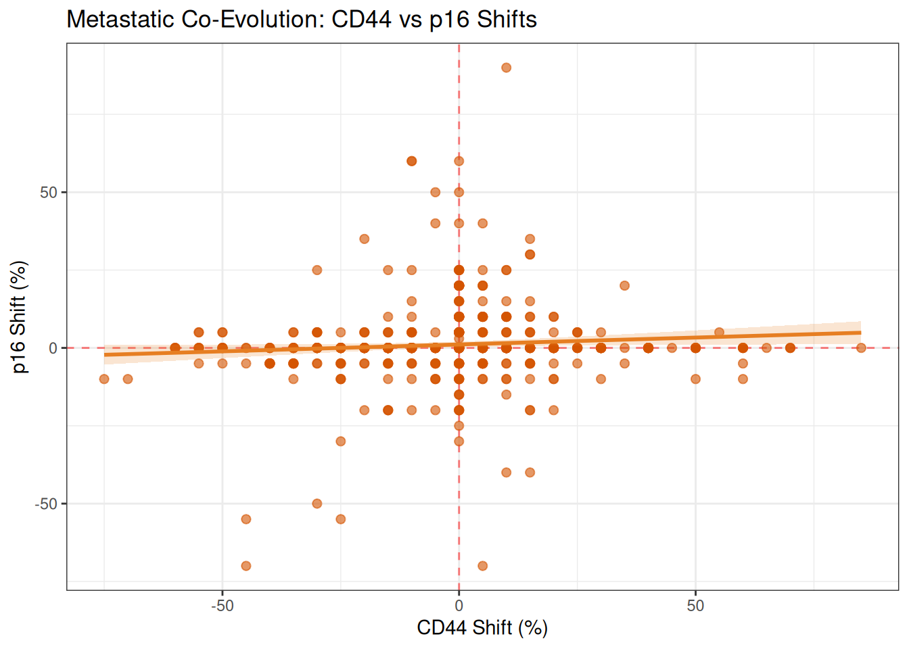

 

</section>
<section id="mixed-model-predicting-p53-shift-via-cd44-shift" class="level3">
<h3 class="anchored" data-anchor-id="mixed-model-predicting-p53-shift-via-cd44-shift">Mixed Model: Predicting p53 Shift via CD44 Shift</h3>
<table>
<thead>
<tr>
<th style="empty-cells: hide;border-bottom:hidden;" colspan="1">
</th>
<th style="border-bottom:hidden;padding-bottom:0; padding-left:3px;padding-right:3px;text-align: center; " colspan="3">

p53 Shift (LN - PT)

</th>
</tr>
<tr>
<th style="text-align:left;">
Predictors
</th>
<th style="text-align:left;">
Estimates
</th>
<th style="text-align:left;">
CI
</th>
<th style="text-align:left;">
p
</th>
</tr>
</thead>
<tbody>
<tr>
<td style="text-align:left;">
(Intercept)
</td>
<td style="text-align:left;">
-0.02
</td>
<td style="text-align:left;">
-3.00&nbsp;–&nbsp;2.95
</td>
<td style="text-align:left;">
0.987
</td>
</tr>
<tr>
<td style="text-align:left;">
CD44 Shift
</td>
<td style="text-align:left;">
0.06
</td>
<td style="text-align:left;">
-0.01&nbsp;–&nbsp;0.13
</td>
<td style="text-align:left;">
0.089
</td>
</tr>
<tr>
<td style="text-align:left;">
Random Effects
</td>
<td style="text-align:left;">
</td>
<td style="text-align:left;">
</td>
<td style="text-align:left;">
</td>
</tr>
<tr>
<td style="text-align:left;">
σ2
</td>
<td style="text-align:left;">
142.82
</td>
<td style="text-align:left;">
</td>
<td style="text-align:left;">
</td>
</tr>
<tr>
<td style="text-align:left;">
τ00patient_ID
</td>
<td style="text-align:left;">
390.34
</td>
<td style="text-align:left;">
</td>
<td style="text-align:left;">
</td>
</tr>
<tr>
<td style="text-align:left;">
ICC
</td>
<td style="text-align:left;">
0.73
</td>
<td style="text-align:left;">
</td>
<td style="text-align:left;">
</td>
</tr>
<tr>
<td style="text-align:left;">
N patient_ID
</td>
<td style="text-align:left;">
205
</td>
<td style="text-align:left;">
</td>
<td style="text-align:left;">
</td>
</tr>
<tr>
<td style="text-align:left;">
Observations
</td>
<td style="text-align:left;">
632
</td>
<td style="text-align:left;">
</td>
<td style="text-align:left;">
</td>
</tr>
<tr>
<td style="text-align:left;">
Marginal <mjx-container class="MathJax CtxtMenu_Attached_0" jax="CHTML" style="font-size: 117.1%; position: relative;" tabindex="0" ctxtmenu_counter="10"><mjx-math class="MJX-TEX" aria-hidden="true"><mjx-msup><mjx-mi class="mjx-i"><mjx-c class="mjx-c1D445 TEX-I"></mjx-c></mjx-mi><mjx-script style="vertical-align: 0.363em;"><mjx-mn class="mjx-n" size="s"><mjx-c class="mjx-c32"></mjx-c></mjx-mn></mjx-script></mjx-msup></mjx-math><mjx-assistive-mml unselectable="on" display="inline"><math xmlns="http://www.w3.org/1998/Math/MathML"><msup><mi>R</mi><mn>2</mn></msup></math></mjx-assistive-mml></mjx-container> / Conditional <mjx-container class="MathJax CtxtMenu_Attached_0" jax="CHTML" style="font-size: 117.1%; position: relative;" tabindex="0" ctxtmenu_counter="11"><mjx-math class="MJX-TEX" aria-hidden="true"><mjx-msup><mjx-mi class="mjx-i"><mjx-c class="mjx-c1D445 TEX-I"></mjx-c></mjx-mi><mjx-script style="vertical-align: 0.363em;"><mjx-mn class="mjx-n" size="s"><mjx-c class="mjx-c32"></mjx-c></mjx-mn></mjx-script></mjx-msup></mjx-math><mjx-assistive-mml unselectable="on" display="inline"><math xmlns="http://www.w3.org/1998/Math/MathML"><msup><mi>R</mi><mn>2</mn></msup></math></mjx-assistive-mml></mjx-container>
</td>
<td style="text-align:left;">
0.003 / 0.733
</td>
<td style="text-align:left;">
</td>
<td style="text-align:left;">
</td>
</tr>
</tbody>
</table>

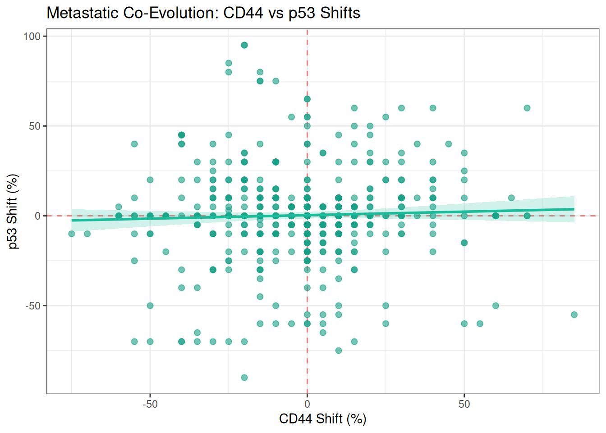

 

</section>
</section>
<section id="takeaway-biomarkers-evolve-in-coupled-not-in-isolation." class="level2">
<h2 class="anchored" data-anchor-id="takeaway-biomarkers-evolve-in-coupled-not-in-isolation.">5. Takeaway: Biomarkers evolve in coupled, not in isolation.</h2>

The mixed-shift models demonstrate significant co-evolutionary 
dynamics, most notably between CD44 and CD98. Rather than adapting 
independently, when CD44 expression shifts during metastasis, CD98 
shifts in a predictable, correlated direction. This coupled adaptation 
points toward shared regulatory networks in the metastatic environment, 
suggesting that these proteins may be driven by similar environmental 
pressures or represent joint therapeutic vulnerabilities. Statistically 
significant also the shift betwwen p16 andCD44 expression shift.

</section>
</section>
<section id="prognostic-impact-recurrence-analysis" class="level1">
<h1>6. Prognostic Impact (Recurrence Analysis)</h1>

We evaluate the prognostic relevance of biomarker expression on LRC. 
To account for underlying baseline differences between the original 
patient groups, all survival models are stratified by the cohort of 
origin. For models evaluating Lymph Node (LN) metastases, a robust 
variance estimator (patient-level clustering) is included to account for
 intra-patient correlation when multiple nodes are present.

The evaluation strategy is tailored to the nature of each biomarker:

<ul>
<li>
Established Clinical Markers (p16 &amp; p53): Evaluated across 
the pooled cohort using strict, predefined clinical thresholds (≥ 70% 
for p16 as an HPV surrogate; established mutation archetypes for p53).
</li>
<li>
Exploratory Biomarkers (CD44 &amp; CD98): Evaluated using a two-step hybrid approach:

<ul>
<li>Continuous Analysis (Pooled Cohort): The markers are first evaluated
 continuously across all available samples to establish robust 
biological associations without the bias of threshold selection.</li>
<li>Categorical Validation (Discovery/Validation Split): To provide 
clinically actionable thresholds, an optimal cut-off is mathematically 
derived strictly within a discovery subset (DKTKRO2a). This derived 
threshold is then independently tested in a distinct validation cohort 
(DKTKRO1a, FK, HNLOR) to confirm its prognostic utility and avoid 
overfitting.</li>
</ul></li>
</ul>
<section id="primary-tumor-pt-survival-analysis" class="level3">
<h3 class="anchored" data-anchor-id="primary-tumor-pt-survival-analysis">6.1 Primary Tumor (PT) Survival Analysis</h3>
<section id="pt-survival-analysis-p53" class="level4">
<h4 class="anchored" data-anchor-id="pt-survival-analysis-p53">PT Survival Analysis: p53</h4>

Using mutation archetypes: Wild-Type (6-79%) vs Aberrant (&lt;=5% or &gt;=80%) on Pooled Cohort

<table class="caption-top table">
<caption>PT Biological p53 Archetypes</caption>
<thead>
<tr class="header">
<th style="text-align: left;">term</th>
<th style="text-align: right;">estimate</th>
<th style="text-align: right;">std.error</th>
<th style="text-align: right;">statistic</th>
<th style="text-align: right;">p.value</th>
</tr>
</thead>
<tbody>
<tr class="odd">
<td style="text-align: left;">Risk_GroupAberrant_Pattern</td>
<td style="text-align: right;">0.661</td>
<td style="text-align: right;">0.339</td>
<td style="text-align: right;">-1.224</td>
<td style="text-align: right;">0.221</td>
</tr>
</tbody>
</table>
</section>
<section id="pt-survival-analysis-p16" class="level4">
<h4 class="anchored" data-anchor-id="pt-survival-analysis-p16">PT Survival Analysis: p16</h4>

Using clinical cut-off: &gt;= 70% (HPV surrogate) on Pooled Cohort

<table class="caption-top table">
<caption>PT Clinical p16 (70% cut-off)</caption>
<colgroup>
<col style="width: 44%">
<col style="width: 13%">
<col style="width: 14%">
<col style="width: 14%">
<col style="width: 11%">
</colgroup>
<thead>
<tr class="header">
<th style="text-align: left;">term</th>
<th style="text-align: right;">estimate</th>
<th style="text-align: right;">std.error</th>
<th style="text-align: right;">statistic</th>
<th style="text-align: right;">p.value</th>
</tr>
</thead>
<tbody>
<tr class="odd">
<td style="text-align: left;">Risk_GroupLow/Negative (&lt;70%)</td>
<td style="text-align: right;">8.799</td>
<td style="text-align: right;">0.731</td>
<td style="text-align: right;">2.974</td>
<td style="text-align: right;">0.003</td>
</tr>
</tbody>
</table>
</section>
<section id="pt-survival-analysis-cd44" class="level4">
<h4 class="anchored" data-anchor-id="pt-survival-analysis-cd44">PT Survival Analysis: CD44</h4>

Exploratory Marker: Pooled Continuous Risk followed by Independent Validation of Cut-off

<table class="caption-top table">
<caption>PT Continuous Risk (Pooled Cohort): CD44</caption>
<thead>
<tr class="header">
<th style="text-align: left;">term</th>
<th style="text-align: right;">estimate</th>
<th style="text-align: right;">std.error</th>
<th style="text-align: right;">statistic</th>
<th style="text-align: right;">p.value</th>
</tr>
</thead>
<tbody>
<tr class="odd">
<td style="text-align: left;">Marker_Value</td>
<td style="text-align: right;">1.01</td>
<td style="text-align: right;">0.007</td>
<td style="text-align: right;">1.405</td>
<td style="text-align: right;">0.16</td>
</tr>
</tbody>
</table>

Discovered Cut-off (Discovery Cohort only): &gt;= 5 %

<table class="caption-top table">
<caption>PT Validation Cohort (Cut-off: 5 %)</caption>
<thead>
<tr class="header">
<th style="text-align: left;">term</th>
<th style="text-align: right;">estimate</th>
<th style="text-align: right;">std.error</th>
<th style="text-align: right;">statistic</th>
<th style="text-align: right;">p.value</th>
</tr>
</thead>
<tbody>
<tr class="odd">
<td style="text-align: left;">Risk_GroupHigh</td>
<td style="text-align: right;">1.234</td>
<td style="text-align: right;">0.395</td>
<td style="text-align: right;">0.532</td>
<td style="text-align: right;">0.595</td>
</tr>
</tbody>
</table>
</section>
<section id="pt-survival-analysis-cd98" class="level4">
<h4 class="anchored" data-anchor-id="pt-survival-analysis-cd98">PT Survival Analysis: CD98</h4>

Exploratory Marker: Pooled Continuous Risk followed by Independent Validation of Cut-off

<table class="caption-top table">
<caption>PT Continuous Risk (Pooled Cohort): CD98</caption>
<thead>
<tr class="header">
<th style="text-align: left;">term</th>
<th style="text-align: right;">estimate</th>
<th style="text-align: right;">std.error</th>
<th style="text-align: right;">statistic</th>
<th style="text-align: right;">p.value</th>
</tr>
</thead>
<tbody>
<tr class="odd">
<td style="text-align: left;">Marker_Value</td>
<td style="text-align: right;">1.021</td>
<td style="text-align: right;">0.006</td>
<td style="text-align: right;">3.238</td>
<td style="text-align: right;">0.001</td>
</tr>
</tbody>
</table>

Discovered Cut-off (Discovery Cohort only): &gt;= 40 %

<table class="caption-top table">
<caption>PT Validation Cohort (Cut-off: 40 %)</caption>
<thead>
<tr class="header">
<th style="text-align: left;">term</th>
<th style="text-align: right;">estimate</th>
<th style="text-align: right;">std.error</th>
<th style="text-align: right;">statistic</th>
<th style="text-align: right;">p.value</th>
</tr>
</thead>
<tbody>
<tr class="odd">
<td style="text-align: left;">Risk_GroupHigh</td>
<td style="text-align: right;">3.442</td>
<td style="text-align: right;">0.435</td>
<td style="text-align: right;">2.844</td>
<td style="text-align: right;">0.004</td>
</tr>
</tbody>
</table>
</section>
</section>
<section id="lymph-node-ln-metastases-survival-analysis" class="level3">
<h3 class="anchored" data-anchor-id="lymph-node-ln-metastases-survival-analysis">6.2 Lymph Node (LN) Metastases Survival Analysis</h3>
<section id="ln-survival-analysis-p53" class="level4">
<h4 class="anchored" data-anchor-id="ln-survival-analysis-p53">LN Survival Analysis: p53</h4>

Using mutation archetypes: Wild-Type (6-79%) vs Aberrant (&lt;=5% or &gt;=80%) on Pooled Cohort

<table class="caption-top table">
<caption>LN Biological p53 Archetypes</caption>
<colgroup>
<col style="width: 36%">
<col style="width: 12%">
<col style="width: 13%">
<col style="width: 13%">
<col style="width: 13%">
<col style="width: 10%">
</colgroup>
<thead>
<tr class="header">
<th style="text-align: left;">term</th>
<th style="text-align: right;">estimate</th>
<th style="text-align: right;">std.error</th>
<th style="text-align: right;">robust.se</th>
<th style="text-align: right;">statistic</th>
<th style="text-align: right;">p.value</th>
</tr>
</thead>
<tbody>
<tr class="odd">
<td style="text-align: left;">Risk_GroupAberrant_Pattern</td>
<td style="text-align: right;">0.711</td>
<td style="text-align: right;">0.178</td>
<td style="text-align: right;">0.355</td>
<td style="text-align: right;">-0.963</td>
<td style="text-align: right;">0.336</td>
</tr>
</tbody>
</table>
</section>
<section id="ln-survival-analysis-p16" class="level4">
<h4 class="anchored" data-anchor-id="ln-survival-analysis-p16">LN Survival Analysis: p16</h4>

Using clinical cut-off: &gt;= 70% (HPV surrogate) on Pooled Cohort

<table class="caption-top table">
<caption>LN Clinical p16 (70% cut-off)</caption>
<colgroup>
<col style="width: 38%">
<col style="width: 11%">
<col style="width: 12%">
<col style="width: 12%">
<col style="width: 12%">
<col style="width: 10%">
</colgroup>
<thead>
<tr class="header">
<th style="text-align: left;">term</th>
<th style="text-align: right;">estimate</th>
<th style="text-align: right;">std.error</th>
<th style="text-align: right;">robust.se</th>
<th style="text-align: right;">statistic</th>
<th style="text-align: right;">p.value</th>
</tr>
</thead>
<tbody>
<tr class="odd">
<td style="text-align: left;">Risk_GroupLow/Negative (&lt;70%)</td>
<td style="text-align: right;">7.281</td>
<td style="text-align: right;">0.394</td>
<td style="text-align: right;">0.677</td>
<td style="text-align: right;">2.931</td>
<td style="text-align: right;">0.003</td>
</tr>
</tbody>
</table>
</section>
<section id="ln-survival-analysis-cd44" class="level4">
<h4 class="anchored" data-anchor-id="ln-survival-analysis-cd44">LN Survival Analysis: CD44</h4>

Exploratory Marker: Pooled Continuous Risk followed by Independent Validation of Cut-off

<table class="caption-top table">
<caption>LN Continuous Risk (Pooled Cohort): CD44</caption>
<thead>
<tr class="header">
<th style="text-align: left;">term</th>
<th style="text-align: right;">estimate</th>
<th style="text-align: right;">std.error</th>
<th style="text-align: right;">robust.se</th>
<th style="text-align: right;">statistic</th>
<th style="text-align: right;">p.value</th>
</tr>
</thead>
<tbody>
<tr class="odd">
<td style="text-align: left;">Marker_Value</td>
<td style="text-align: right;">1.018</td>
<td style="text-align: right;">0.003</td>
<td style="text-align: right;">0.005</td>
<td style="text-align: right;">3.529</td>
<td style="text-align: right;">0</td>
</tr>
</tbody>
</table>

Discovered Cut-off (Discovery Cohort only): &gt;= 25 %

<table class="caption-top table">
<caption>LN Validation Cohort (Cut-off: 25 %)</caption>
<thead>
<tr class="header">
<th style="text-align: left;">term</th>
<th style="text-align: right;">estimate</th>
<th style="text-align: right;">std.error</th>
<th style="text-align: right;">robust.se</th>
<th style="text-align: right;">statistic</th>
<th style="text-align: right;">p.value</th>
</tr>
</thead>
<tbody>
<tr class="odd">
<td style="text-align: left;">Risk_GroupHigh</td>
<td style="text-align: right;">2.123</td>
<td style="text-align: right;">0.261</td>
<td style="text-align: right;">0.393</td>
<td style="text-align: right;">1.915</td>
<td style="text-align: right;">0.056</td>
</tr>
</tbody>
</table>
</section>
<section id="ln-survival-analysis-cd98" class="level4">
<h4 class="anchored" data-anchor-id="ln-survival-analysis-cd98">LN Survival Analysis: CD98</h4>

Exploratory Marker: Pooled Continuous Risk followed by Independent Validation of Cut-off

<table class="caption-top table">
<caption>LN Continuous Risk (Pooled Cohort): CD98</caption>
<thead>
<tr class="header">
<th style="text-align: left;">term</th>
<th style="text-align: right;">estimate</th>
<th style="text-align: right;">std.error</th>
<th style="text-align: right;">robust.se</th>
<th style="text-align: right;">statistic</th>
<th style="text-align: right;">p.value</th>
</tr>
</thead>
<tbody>
<tr class="odd">
<td style="text-align: left;">Marker_Value</td>
<td style="text-align: right;">1.016</td>
<td style="text-align: right;">0.003</td>
<td style="text-align: right;">0.005</td>
<td style="text-align: right;">3.123</td>
<td style="text-align: right;">0.002</td>
</tr>
</tbody>
</table>

Discovered Cut-off (Discovery Cohort only): &gt;= 30 %

<table class="caption-top table">
<caption>LN Validation Cohort (Cut-off: 30 %)</caption>
<thead>
<tr class="header">
<th style="text-align: left;">term</th>
<th style="text-align: right;">estimate</th>
<th style="text-align: right;">std.error</th>
<th style="text-align: right;">robust.se</th>
<th style="text-align: right;">statistic</th>
<th style="text-align: right;">p.value</th>
</tr>
</thead>
<tbody>
<tr class="odd">
<td style="text-align: left;">Risk_GroupHigh</td>
<td style="text-align: right;">5.639</td>
<td style="text-align: right;">0.361</td>
<td style="text-align: right;">0.493</td>
<td style="text-align: right;">3.51</td>
<td style="text-align: right;">0</td>
</tr>
</tbody>
</table>
</section>
</section>
<section id="primary-tumor-pt-survival-analysis-1" class="level3">
<h3 class="anchored" data-anchor-id="primary-tumor-pt-survival-analysis-1">6.1 Primary Tumor (PT) Survival Analysis</h3>
<section id="pt-survival-analysis-p53-1" class="level4">
<h4 class="anchored" data-anchor-id="pt-survival-analysis-p53-1">PT Survival Analysis: p53</h4>

Using mutation archetypes: Wild-Type (6-79%) vs Aberrant (&lt;=5% or &gt;=80%) on Pooled Cohort

<table class="caption-top table">
<caption>PT Biological p53 Archetypes</caption>
<thead>
<tr class="header">
<th style="text-align: left;">term</th>
<th style="text-align: right;">estimate</th>
<th style="text-align: right;">std.error</th>
<th style="text-align: right;">statistic</th>
<th style="text-align: right;">p.value</th>
</tr>
</thead>
<tbody>
<tr class="odd">
<td style="text-align: left;">Risk_GroupAberrant_Pattern</td>
<td style="text-align: right;">0.661</td>
<td style="text-align: right;">0.339</td>
<td style="text-align: right;">-1.224</td>
<td style="text-align: right;">0.221</td>
</tr>
</tbody>
</table>
</section>
<section id="pt-survival-analysis-p16-1" class="level4">
<h4 class="anchored" data-anchor-id="pt-survival-analysis-p16-1">PT Survival Analysis: p16</h4>

Using clinical cut-off: &gt;= 70% (HPV surrogate) on Pooled Cohort

<table class="caption-top table">
<caption>PT Clinical p16 (70% cut-off)</caption>
<colgroup>
<col style="width: 44%">
<col style="width: 13%">
<col style="width: 14%">
<col style="width: 14%">
<col style="width: 11%">
</colgroup>
<thead>
<tr class="header">
<th style="text-align: left;">term</th>
<th style="text-align: right;">estimate</th>
<th style="text-align: right;">std.error</th>
<th style="text-align: right;">statistic</th>
<th style="text-align: right;">p.value</th>
</tr>
</thead>
<tbody>
<tr class="odd">
<td style="text-align: left;">Risk_GroupLow/Negative (&lt;70%)</td>
<td style="text-align: right;">8.799</td>
<td style="text-align: right;">0.731</td>
<td style="text-align: right;">2.974</td>
<td style="text-align: right;">0.003</td>
</tr>
</tbody>
</table>
</section>
<section id="pt-survival-analysis-cd44-1" class="level4">
<h4 class="anchored" data-anchor-id="pt-survival-analysis-cd44-1">PT Survival Analysis: CD44</h4>

Exploratory Marker: Pooled Cross-Validated Predictions

<strong>Final Pooled Cross-Validated Cox Model</strong>

<table class="caption-top table">
<caption>PT Pooled CV Performance: CD44</caption>
<thead>
<tr class="header">
<th style="text-align: left;">term</th>
<th style="text-align: right;">estimate</th>
<th style="text-align: right;">std.error</th>
<th style="text-align: right;">statistic</th>
<th style="text-align: right;">p.value</th>
</tr>
</thead>
<tbody>
<tr class="odd">
<td style="text-align: left;">Risk_GroupHigh</td>
<td style="text-align: right;">1.638</td>
<td style="text-align: right;">0.356</td>
<td style="text-align: right;">1.386</td>
<td style="text-align: right;">0.166</td>
</tr>
</tbody>
</table>
</section>
<section id="pt-survival-analysis-cd98-1" class="level4">
<h4 class="anchored" data-anchor-id="pt-survival-analysis-cd98-1">PT Survival Analysis: CD98</h4>

Exploratory Marker: Pooled Cross-Validated Predictions

<strong>Final Pooled Cross-Validated Cox Model</strong>

<table class="caption-top table">
<caption>PT Pooled CV Performance: CD98</caption>
<thead>
<tr class="header">
<th style="text-align: left;">term</th>
<th style="text-align: right;">estimate</th>
<th style="text-align: right;">std.error</th>
<th style="text-align: right;">statistic</th>
<th style="text-align: right;">p.value</th>
</tr>
</thead>
<tbody>
<tr class="odd">
<td style="text-align: left;">Risk_GroupHigh</td>
<td style="text-align: right;">2.014</td>
<td style="text-align: right;">0.379</td>
<td style="text-align: right;">1.849</td>
<td style="text-align: right;">0.064</td>
</tr>
</tbody>
</table>
</section>
</section>
<section id="lymph-node-ln-metastases-survival-analysis-1" class="level3">
<h3 class="anchored" data-anchor-id="lymph-node-ln-metastases-survival-analysis-1">6.2 Lymph Node (LN) Metastases Survival Analysis</h3>
<section id="ln-survival-analysis-p53-1" class="level4">
<h4 class="anchored" data-anchor-id="ln-survival-analysis-p53-1">LN Survival Analysis: p53</h4>

Using mutation archetypes: Wild-Type (6-79%) vs Aberrant (&lt;=5% or &gt;=80%) on Pooled Cohort

<table class="caption-top table">
<caption>LN Biological p53 Archetypes</caption>
<colgroup>
<col style="width: 36%">
<col style="width: 12%">
<col style="width: 13%">
<col style="width: 13%">
<col style="width: 13%">
<col style="width: 10%">
</colgroup>
<thead>
<tr class="header">
<th style="text-align: left;">term</th>
<th style="text-align: right;">estimate</th>
<th style="text-align: right;">std.error</th>
<th style="text-align: right;">robust.se</th>
<th style="text-align: right;">statistic</th>
<th style="text-align: right;">p.value</th>
</tr>
</thead>
<tbody>
<tr class="odd">
<td style="text-align: left;">Risk_GroupAberrant_Pattern</td>
<td style="text-align: right;">0.711</td>
<td style="text-align: right;">0.178</td>
<td style="text-align: right;">0.355</td>
<td style="text-align: right;">-0.963</td>
<td style="text-align: right;">0.336</td>
</tr>
</tbody>
</table>
</section>
<section id="ln-survival-analysis-p16-1" class="level4">
<h4 class="anchored" data-anchor-id="ln-survival-analysis-p16-1">LN Survival Analysis: p16</h4>

Using clinical cut-off: &gt;= 70% (HPV surrogate) on Pooled Cohort

<table class="caption-top table">
<caption>LN Clinical p16 (70% cut-off)</caption>
<colgroup>
<col style="width: 38%">
<col style="width: 11%">
<col style="width: 12%">
<col style="width: 12%">
<col style="width: 12%">
<col style="width: 10%">
</colgroup>
<thead>
<tr class="header">
<th style="text-align: left;">term</th>
<th style="text-align: right;">estimate</th>
<th style="text-align: right;">std.error</th>
<th style="text-align: right;">robust.se</th>
<th style="text-align: right;">statistic</th>
<th style="text-align: right;">p.value</th>
</tr>
</thead>
<tbody>
<tr class="odd">
<td style="text-align: left;">Risk_GroupLow/Negative (&lt;70%)</td>
<td style="text-align: right;">7.281</td>
<td style="text-align: right;">0.394</td>
<td style="text-align: right;">0.677</td>
<td style="text-align: right;">2.931</td>
<td style="text-align: right;">0.003</td>
</tr>
</tbody>
</table>
</section>
<section id="ln-survival-analysis-cd44-1" class="level4">
<h4 class="anchored" data-anchor-id="ln-survival-analysis-cd44-1">LN Survival Analysis: CD44</h4>

Exploratory Marker: Pooled Cross-Validated Predictions Optimal cutoffs 10 25 25 10

<strong>Final Pooled Cross-Validated Cox Model</strong>

<table class="caption-top table">
<caption>LN Pooled CV Performance: CD44</caption>
<thead>
<tr class="header">
<th style="text-align: left;">term</th>
<th style="text-align: right;">estimate</th>
<th style="text-align: right;">std.error</th>
<th style="text-align: right;">robust.se</th>
<th style="text-align: right;">statistic</th>
<th style="text-align: right;">p.value</th>
</tr>
</thead>
<tbody>
<tr class="odd">
<td style="text-align: left;">Risk_GroupHigh</td>
<td style="text-align: right;">2.452</td>
<td style="text-align: right;">0.211</td>
<td style="text-align: right;">0.312</td>
<td style="text-align: right;">2.872</td>
<td style="text-align: right;">0.004</td>
</tr>
</tbody>
</table>
</section>
<section id="ln-survival-analysis-cd98-1" class="level4">
<h4 class="anchored" data-anchor-id="ln-survival-analysis-cd98-1">LN Survival Analysis: CD98</h4>

Exploratory Marker: Pooled Cross-Validated Predictions Optimal cutoffs 25 30 25 25

<strong>Final Pooled Cross-Validated Cox Model</strong>

<table class="caption-top table">
<caption>LN Pooled CV Performance: CD98</caption>
<thead>
<tr class="header">
<th style="text-align: left;">term</th>
<th style="text-align: right;">estimate</th>
<th style="text-align: right;">std.error</th>
<th style="text-align: right;">robust.se</th>
<th style="text-align: right;">statistic</th>
<th style="text-align: right;">p.value</th>
</tr>
</thead>
<tbody>
<tr class="odd">
<td style="text-align: left;">Risk_GroupHigh</td>
<td style="text-align: right;">6.487</td>
<td style="text-align: right;">0.351</td>
<td style="text-align: right;">0.41</td>
<td style="text-align: right;">4.559</td>
<td style="text-align: right;">0</td>
</tr>
</tbody>
</table>
</section>
</section>
<section id="takeaway-lymph-node-biomarker-profiles-are-robust-biologically-grounded-predictors-of-locoregional-recurrence." class="level2">
<h2 class="anchored" data-anchor-id="takeaway-lymph-node-biomarker-profiles-are-robust-biologically-grounded-predictors-of-locoregional-recurrence.">6. Takeaway: Lymph node biomarker profiles are robust, biologically grounded predictors of locoregional recurrence.</h2>

The survival analysis reveals a critical divergence in prognostic 
power between the primary tumor and the metastatic niche. While the 
established clinical marker p16 strongly predicts locoregional control 
across both (with p16-negativity driving high risk), and CD98 indicates 
general tumor aggressiveness in both the primary and nodal disease, CD44
 tells a highly site-specific story. CD44 expression holds significant 
prognostic value only when evaluated within the lymph node metastasis 
(Continuous p &lt; 0.001; Categorical Validation p = 0.032). It fails to
 show any significant association with recurrence when measured in the 
primary tumor. This strongly reinforces that metastatic deposits 
establish an adapted biological phenotype, and evaluating the lymph node
 directly provides critical risk stratification for locoregional 
recurrence that the primary biopsy misses. (Note: p53 mutational 
archetypes did not stratify risk significantly in either tissue 
compartment for this cohort).

</section>
<section id="joint-multivariable-cox-models-unaggregated-clustered" class="level2">
<h2 class="anchored" data-anchor-id="joint-multivariable-cox-models-unaggregated-clustered">7 Joint Multivariable Cox Models (Unaggregated / Clustered)</h2>

We utilized Joint Multivariable Cox Proportional-Hazards Models. By 
placing the paired PT and LN expression values into direct statistical 
competition within the same model, we test for independent prognostic 
relevance. This analysis determines whether the primary biopsy is 
sufficient for risk estimation, or if the biology of the metastatic 
lymph node supersedes the primary tumor to act as the primary driver of 
locoregional recurrence. To robustly handle data from patients with 
multiple evaluated lymph nodes, all models incorporate patient-level 
clustering.

<strong>Marker: p53_expr </strong>( 606 LN samples across 201 patients)

PT Effect -&gt; HR: 1 | p-val: 0.967

LN Effect -&gt; HR: 1 | p-val: 0.6981

CONCLUSION: Neither is significantly prognostic in the joint model (likely collinearity or lack of power).

<strong>Marker: p16_expr </strong>( 608 LN samples across 201 patients)

PT Effect -&gt; HR: 1.02 | p-val: 0.1824

LN Effect -&gt; HR: 0.97 | p-val: 0.0037

CONCLUSION: Metastasis (LN) is a stronger, independent predictor. PT loses relevance.

<strong>Marker: CD44_expr </strong>( 608 LN samples across 201 patients)

PT Effect -&gt; HR: 1.01 | p-val: 0.0755

LN Effect -&gt; HR: 1.01 | p-val: 0.0042

CONCLUSION: Metastasis (LN) is a stronger, independent predictor. PT loses relevance.

<strong>Marker: CD98_expr </strong>( 611 LN samples across 203 patients)

PT Effect -&gt; HR: 1.01 | p-val: 0.4027

LN Effect -&gt; HR: 1.01 | p-val: 0.0497

CONCLUSION: Metastasis (LN) is a stronger, independent predictor. PT loses relevance.

</section>
<section id="takeaway" class="level2">
<h2 class="anchored" data-anchor-id="takeaway">7. Takeaway</h2>

When placed in direct statistical competition, the expression of p16,
 CD44, and CD98 in the lymph node emerges as the stronger, independent 
predictor of locoregional control, while the prognostic relevance of the
 primary tumor diminishes.

<strong>End of Analysis Document</strong>

</section>
</section>

</main>
<!-- /main column -->

 <!-- /content -->

</body></html>
